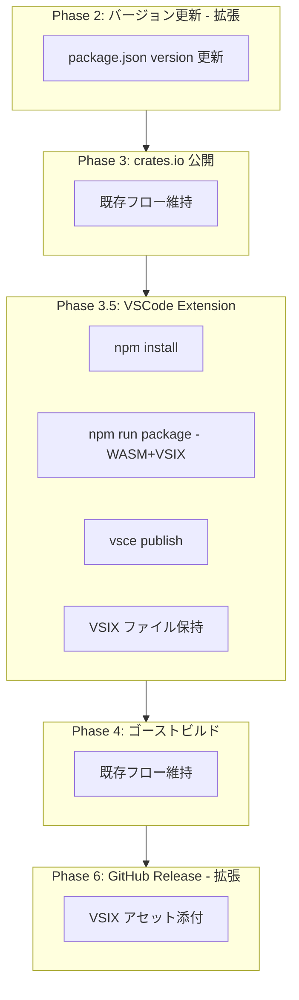
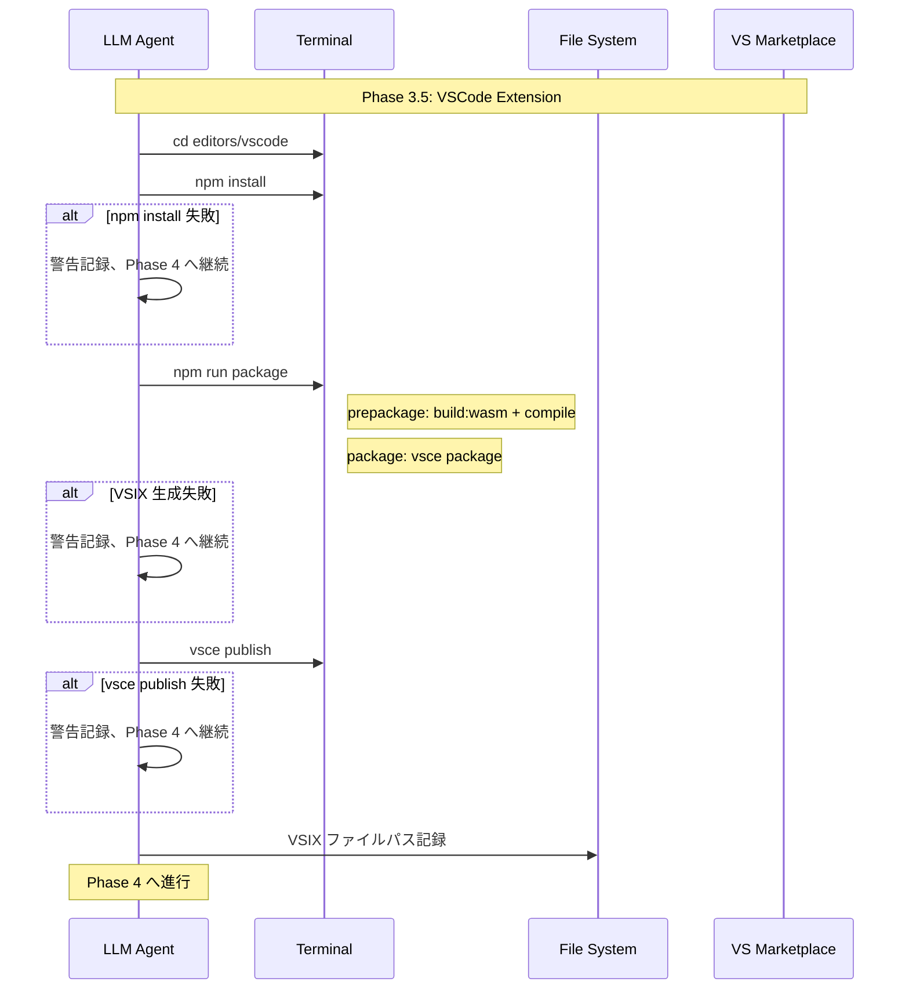

# Technical Design: vscode-extension-release

## Overview

**Purpose**: 本設計は、Pasta DSL VSCode 拡張機能を Visual Studio Code Marketplace に公開するためのドキュメント整備・メタデータ完備・パッケージングフローを定義し、既存仕様 `release-workflow` への統合方法を規定する。

**Users**: 
- **拡張機能利用者**: Marketplace で Pasta DSL の概要・機能・使い方を確認し、インストールする
- **開発者（ekicyou）**: リリースフロー実行時に VSCode 拡張を含む全成果物を一括公開する

**Impact**: 既存の `release-workflow`（Phase 0〜6 のシーケンシャルパイプライン）に VSCode 拡張ステップを追加し、crates.io + GitHub Release + Marketplace の三位一体リリースを実現する。

### Goals
- Marketplace 公開に必要なドキュメント（README、CHANGELOG）とメタデータ（package.json）を整備する
- `release-workflow` の Phase 構造に VSCode 拡張公開ステップを統合する
- VSIX パッケージングと `vsce publish` を標準化する
- バージョン番号の Cargo.toml ⇔ package.json 同期を確立する

### Non-Goals
- CI/CD パイプラインでの自動公開（ローカル LLM 実行前提）
- 拡張機能の新機能実装（公開準備のみ）
- Marketplace アナリティクスやレビュー管理
- Pre-release チャネルの構築

## Architecture

### Existing Architecture Analysis

本仕様は 2 つの側面を持つ:

1. **ドキュメント・メタデータ整備**（ワンショット作業）: README リライト、CHANGELOG 作成、package.json 拡充、.vscodeignore 確認
2. **release-workflow 統合**（繰り返し実行型）: 既存パイプラインへの VSCode 拡張ステップ挿入

**既存アセット状態**:

| アセット | 現状 | 必要な変更 |
|----------|------|------------|
| `editors/vscode/README.md` | 開発者向け（150行） | ユーザー向けに全面リライト |
| `editors/vscode/CHANGELOG.md` | **存在しない** | 新規作成 |
| `editors/vscode/package.json` | 基本メタデータあり、v0.1.3 | `icon`, `keywords`, `homepage`, `bugs` 追加 |
| `editors/vscode/.vscodeignore` | 設定済み（最近更新） | 確認のみ（追加除外は不要） |
| `img/pasta.svg` | 512x512 SVG ロゴ | そのまま使用（icon フィールドから参照） |
| `img/screenshot-syntax-highlight.png` | 42KB スクリーンショット | README で使用 |
| `release-workflow` design.md | Phase 0〜6 定義済み | Phase 追加・Phase 2/6 修正 |

**保持すべきパターン**:
- release-workflow の Sequential Pipeline アーキテクチャ
- LLM エージェントによる対話的実行モデル
- Conventional Commits によるコミットメッセージ規約
- `replace_string_in_file` によるバージョン更新手法

### Architecture Pattern & Boundary Map

**選択パターン**: release-workflow の既存 Sequential Pipeline を拡張。Phase 2 と Phase 6 を修正し、Phase 3 と Phase 4 の間に新規ステップを挿入する。



**ドメイン境界**:
- **ドキュメント整備域**: README、CHANGELOG（ワンショット作業、リリース前に完了）
- **メタデータ整備域**: package.json（ワンショット + バージョン同期は繰り返し）
- **リリースパイプライン域**: release-workflow Phase 2/3.5/6（繰り返し実行）

**Steering 準拠**:
- workflow.md: 各フェーズの独立したゲートとエラー時停止
- tech.md: semver 準拠のバージョニング

### Technology Stack

| Layer | Choice / Version | Role in Feature | Notes |
|-------|------------------|-----------------|-------|
| CLI | `vsce` (@vscode/vsce ^3.0.0) | VSIX パッケージング・Marketplace 公開 | グローバルインストール済み |
| CLI | `npm` | 依存関係管理、ビルドスクリプト実行 | Node.js 18+ |
| CLI | `wasm-pack` | pasta_lsp → WASM ビルド | Rust toolchain 経由 |
| Build | `esbuild` (^0.24.0) | TypeScript バンドル | devDependencies |
| Editor | LLM エディタツール | package.json バージョン更新 | `replace_string_in_file` |
| Auth | `VSCE_PAT` 環境変数 | Marketplace 認証 | PAT 有効期限 2027-02-10 |

## System Flows

### VSCode 拡張公開フロー（release-workflow Phase 3.5）



## Requirements Traceability

| Requirement | Summary | Components | Flows |
|-------------|---------|------------|-------|
| 1.1 | README を editors/vscode/README.md に配置 | ReadmeRewrite | — |
| 1.2 | 概要をドキュメント冒頭に配置 | ReadmeRewrite | — |
| 1.3 | 主要機能一覧を箇条書き | ReadmeRewrite | — |
| 1.4 | スクリーンショット掲載 | ReadmeRewrite | — |
| 1.5 | VSCode バージョン要件記載 | ReadmeRewrite | — |
| 1.6 | Pasta DSL 紹介とリポジトリリンク | ReadmeRewrite | — |
| 1.7 | MIT ライセンス記載 | ReadmeRewrite | — |
| 1.8 | 開発者向け情報の分離 | ReadmeRewrite | — |
| 1.9 | description との整合性 | ReadmeRewrite, PackageMetadata | — |
| 2.1 | CHANGELOG 作成 | ChangelogCreate | — |
| 2.2 | Keep a Changelog 準拠 | ChangelogCreate | — |
| 2.3 | カテゴリ分類 | ChangelogCreate | — |
| 2.4 | 新バージョンエントリ追加 | ChangelogCreate | バージョン同期フロー |
| 2.5 | 初回リリース全機能列挙 | ChangelogCreate | — |
| 3.1 | publisher 設定 | PackageMetadata | — |
| 3.2 | icon 設定 | PackageMetadata | — |
| 3.3 | categories 設定 | PackageMetadata | — |
| 3.5 | keywords 設定 | PackageMetadata | — |
| 3.6 | repository 設定 | PackageMetadata | — |
| 3.7 | homepage 設定 | PackageMetadata | — |
| 3.8 | bugs 設定 | PackageMetadata | — |
| 4.1 | バージョン同期維持 | VersionSync | バージョン同期フロー |
| 4.2 | release-workflow でバージョン更新 | VersionSync | Phase 2 拡張 |
| 4.3 | CHANGELOG エントリ追加促進 | VersionSync | — |
| 4.4 | バージョン不一致検知 | VersionSync | Phase 1 拡張 |
| 4.5 | semver 形式使用 | VersionSync | — |
| 5.1 | npm run package で VSIX 生成 | VsixPackaging | Phase 3.5 |
| 5.2 | VSIX ファイル名形式 | VsixPackaging | Phase 3.5 |
| 5.3 | vsce publish サポート | VsixPackaging | Phase 3.5 |
| 5.4 | 公開 URL 報告 | VsixPackaging | Phase 3.5 |
| 5.5 | .vscodeignore によるファイル制御 | VscodeignoreVerify | — |
| 6.1 | release-workflow でバージョン更新 | ReleaseIntegration | Phase 2 拡張 |
| 6.2 | crates.io 公開後に VSIX 公開 | ReleaseIntegration | Phase 3.5 |
| 6.3 | vsce publish 失敗時は継続 | ReleaseIntegration | Phase 3.5 エラーフロー |
| 6.4 | GitHub Release に VSIX 添付 | ReleaseIntegration | Phase 6 拡張 |
| 6.5 | npm install の事前実行 | ReleaseIntegration | Phase 3.5 |
| 6.6 | 公開成否をサマリーに含める | ReleaseIntegration | Phase 6 拡張 |
| 7.1 | .vscodeignore 配置確認 | VscodeignoreVerify | — |
| 7.2 | 除外ファイル指定 | VscodeignoreVerify | — |
| 7.3 | 含めるファイル指定 | VscodeignoreVerify | — |

## Components and Interfaces

| Component | Domain/Layer | Intent | Req Coverage | Key Dependencies | Contracts |
|-----------|-------------|--------|--------------|-----------------|-----------|
| ReadmeRewrite | ドキュメント | Marketplace 公開用 README の全面リライト | 1.1–1.9 | img/screenshot (P1) | — |
| ChangelogCreate | ドキュメント | CHANGELOG の新規作成 | 2.1–2.5 | — | — |
| PackageMetadata | メタデータ | package.json への必須フィールド追加 | 3.1–3.8 | img/pasta.svg (P1) | — |
| VersionSync | リリース統合 | Cargo.toml ⇔ package.json バージョン同期 | 4.1–4.5 | release-workflow Phase 2 (P0) | — |
| VsixPackaging | リリース統合 | VSIX パッケージング＆Marketplace 公開 | 5.1–5.4, 6.2–6.3, 6.5 | vsce (P0), npm (P0), wasm-pack (P0) | — |
| VscodeignoreVerify | パッケージ最適化 | .vscodeignore の検証 | 5.5, 7.1–7.3 | — | — |
| ReleaseIntegration | リリース統合 | release-workflow への統合設計 | 6.1, 6.4, 6.6 | release-workflow design.md (P0) | — |

### ドキュメント整備レイヤー

#### ReadmeRewrite

| Field | Detail |
|-------|--------|
| Intent | 開発者向け README をユーザー向け Marketplace README に全面リライトする |
| Requirements | 1.1, 1.2, 1.3, 1.4, 1.5, 1.6, 1.7, 1.8, 1.9 |

**Responsibilities & Constraints**
- `editors/vscode/README.md` を Marketplace 表示に最適化されたユーザー向けドキュメントに置換する
- 開発者向け情報（ビルド手順、アーキテクチャ図）は削除または折りたたみ
- `package.json` の `description` と矛盾しない概要文を冒頭に配置

**Dependencies**
- Inbound: `img/screenshot-syntax-highlight.png` — スクリーンショット画像 (P1)
- Inbound: `img/pasta.svg` — ロゴ画像（Marketplace ページヘッダー用の任意使用） (P2)

**README 構成仕様**

以下の構成で README を再作成する:

```
# Pasta DSL

<概要: 1〜2文の拡張機能説明>


## 機能

- TextMate 文法ハイライト（全角/半角マーカー両対応）
- セマンティックトークン（14種類、WASM ベース LSP）
- 診断情報（パースエラー表示）
- フォールバック動作（WASM 不可時は TextMate のみ）

## Pasta DSL とは

<Pasta DSL の簡潔な紹介 + リポジトリリンク>

## 対応環境

- VSCode ^1.85.0

## セマンティックトークン一覧

<現在の README のトークンテーブルを転記>

## ライセンス

MIT
```

**Implementation Notes**
- スクリーンショットのパスは Marketplace でのレンダリングを考慮し、リポジトリルートからの相対パスを使用
- Marketplace は GitHub リポジトリからの画像読み込みに対応しているため、画像を別途ホスティングする必要はない

#### ChangelogCreate

| Field | Detail |
|-------|--------|
| Intent | Keep a Changelog 形式の CHANGELOG を新規作成する |
| Requirements | 2.1, 2.2, 2.3, 2.4, 2.5 |

**Responsibilities & Constraints**
- `editors/vscode/CHANGELOG.md` を新規作成
- [Keep a Changelog](https://keepachangelog.com/) 形式に準拠
- 初回リリース（v0.1.3）の全実装機能を `Added` カテゴリに列挙

**CHANGELOG 初期内容仕様**

```markdown
# Changelog

All notable changes to the "Pasta DSL" extension will be documented in this file.

The format is based on [Keep a Changelog](https://keepachangelog.com/),
and this project adheres to [Semantic Versioning](https://semver.org/).

## [0.1.3] - YYYY-MM-DD

### Added

- TextMate 文法によるシンタックスハイライト（全角/半角マーカー両対応）
- WASM ベース LSP によるセマンティックトークン（14種類）
- パースエラーの診断情報表示（Problems パネル）
- WASM ロード失敗時の TextMate フォールバック動作
- ドキュメント変更時の 200ms デバウンス同期
- Pasta DSL ファイル（*.pasta）の言語登録
```

**Implementation Notes**
- `YYYY-MM-DD` はリリース実施日に置換する（タスクフェーズで具体化）
- 今後のリリースでは release-workflow Phase 3.5 実行前に CHANGELOG 更新を促す

### メタデータ整備レイヤー

#### PackageMetadata

| Field | Detail |
|-------|--------|
| Intent | package.json に Marketplace 公開用メタデータを追加する |
| Requirements | 3.1, 3.2, 3.3, 3.5, 3.6, 3.7, 3.8 |

**Responsibilities & Constraints**
- 既存フィールド（`publisher`, `categories`, `repository`）は保持
- 新規追加: `icon`, `keywords`, `homepage`, `bugs`

**追加フィールド仕様**

| フィールド | 値 | 備考 |
|-----------|-----|------|
| `icon` | `"img/pasta.svg"` | プロジェクトルートの SVG ロゴ |
| `keywords` | `["pasta", "dsl", "ukagaka", "ghost", "scripting"]` | 検索性向上 |
| `homepage` | `"https://github.com/ekicyou/pasta"` | リポジトリをホームページとして使用 |
| `bugs` | `{"url": "https://github.com/ekicyou/pasta/issues"}` | Issue トラッカー |

**Dependencies**
- Inbound: `img/pasta.svg` — アイコン画像ファイル (P1)

**Implementation Notes**
- `icon` パスは拡張機能ルート（`editors/vscode/`）からの相対パス。`img/pasta.svg` はプロジェクトルートにあるため、VSIX パッケージングの際に `.vscodeignore` で除外されないよう注意。ただし vsce は package.json の `icon` パスを解決してパッケージに含めるため、問題なし
- SVG アイコンについて vsce が警告を出す可能性あり（research.md 参照）。初回パッケージング時に確認

#### VscodeignoreVerify

| Field | Detail |
|-------|--------|
| Intent | .vscodeignore の除外・包含ルールが要件に適合していることを検証する |
| Requirements | 5.5, 7.1, 7.2, 7.3 |

**Responsibilities & Constraints**
- 既存 `.vscodeignore` の内容を要件 7.2（除外対象）および 7.3（包含対象）と照合
- 不足があれば修正を提案

**現在の .vscodeignore**:
```
.vscode/**
src/**
node_modules/**
tsconfig.json
**/*.ts
**/*.map
.gitignore
scripts/**
package-lock.json
wasm/README.md
wasm/package.json
```

**検証結果（設計時点）**:
- 7.2 除外対象: `src/` ✅、テストファイル（`**/*.ts` でカバー）✅、`scripts/` ✅、`tsconfig.json` ✅、`package-lock.json` ✅、`wasm/README.md` ✅、`wasm/package.json` ✅
- 7.3 包含対象: `out/extension.js`（`**/*.ts` 除外、`.js` は含まれる）✅、`syntaxes/` ✅、`wasm/*.wasm` ✅、`wasm/*.js` ✅、`wasm/*.d.ts`（`**/*.ts` で除外される可能性）⚠️、`language-configuration.json` ✅、`README.md` ✅、`CHANGELOG.md` ✅、`LICENSE` ✅、`package.json` ✅

**Implementation Notes**
- `wasm/*.d.ts` が `**/*.ts` パターンで除外される可能性がある。vsce の実際のパッケージング結果で確認し、必要なら `.vscodeignore` に `!wasm/*.d.ts` を追加する
- 確認方法: `vsce package` 後に `vsce ls` でパッケージ内容をリストアップ

### リリース統合レイヤー

#### VersionSync

| Field | Detail |
|-------|--------|
| Intent | Cargo.toml と package.json のバージョン番号を同期する仕組みを定義する |
| Requirements | 4.1, 4.2, 4.3, 4.4, 4.5 |

**Responsibilities & Constraints**
- release-workflow Phase 2 で Cargo.toml 更新と同時に package.json を更新
- バージョン不一致検知は release-workflow Phase 1 に追加

**release-workflow Phase 2 への追加手順**:

既存タスク 4（Cargo.toml のバージョン一括更新）に以下を追加:
```
- `editors/vscode/package.json` の `"version": "<OLD>"` → `"version": "<NEW>"` を
  replace_string_in_file で更新する
```

**release-workflow Phase 1 への追加手順**:

既存タスク 3（ワークツリーの整理とテスト実行）に以下の検証を追加:
```
- package.json の version と Cargo.toml の workspace.package.version を比較
- 不一致の場合は警告を表示し、同期するか開発者に確認
```

**Implementation Notes**
- 具体的な release-workflow の tasks.md 修正はタスクフェーズで実施
- CHANGELOG エントリ追加は LLM エージェントが開発者に促す形式（自動生成はしない）

#### VsixPackaging

| Field | Detail |
|-------|--------|
| Intent | VSIX パッケージの生成と Marketplace 公開を実行する |
| Requirements | 5.1, 5.2, 5.3, 5.4, 6.2, 6.3, 6.5 |

**Responsibilities & Constraints**
- `editors/vscode/` ディレクトリで `npm install` → `npm run package` → `vsce publish` を順次実行
- 生成される VSIX: `pasta-vscode-<version>.vsix`
- `vsce publish` 失敗時は警告を記録して後続フェーズに継続

**Dependencies**
- External: `vsce` CLI — Marketplace 公開 (P0)
- External: `wasm-pack` — WASM ビルド (P0)
- External: `npm` — 依存管理 (P0)
- External: `VSCE_PAT` 環境変数 — 認証 (P0)

**実行手順（release-workflow Phase 3.5 として）**:

```
1. cd editors/vscode
2. npm install
3. npm run package
   → prepackage (build:wasm + compile) → vsce package
   → pasta-vscode-X.Y.Z.vsix 生成
4. VSIX 存在確認:
   Test-Path "pasta-vscode-X.Y.Z.vsix"
   → 存在しない場合: 警告記録、ステップ 5 スキップ、Phase 4 へ継続
5. vsce publish
   → 成功: Marketplace URL を記録
   → 失敗: 警告記録、後続フェーズへ継続
6. VSIX ファイルパスを環境変数に保持（Phase 6 で使用）:
   $env:VSIX_PATH = "editors/vscode/pasta-vscode-X.Y.Z.vsix"
```

**Implementation Notes**
- `npm run package` が `prepackage` を自動実行するため、WASM ビルドの明示的呼び出しは不要
- `vsce publish` は `VSCE_PAT` 環境変数が設定されていない場合、対話的に PAT を求める

#### ReleaseIntegration

| Field | Detail |
|-------|--------|
| Intent | release-workflow の設計・タスク文書に VSCode 拡張ステップを統合する |
| Requirements | 6.1, 6.4, 6.6 |

**Responsibilities & Constraints**
- release-workflow の `design.md` に Phase 3.5 の記述を追加
- release-workflow の `tasks.md` にタスクを追加・修正
- Phase 6（GitHub Release）の `gh release create` コマンドに VSIX アセットを追加

**統合ポイント一覧**:

| release-workflow 箇所 | 変更内容 |
|----------------------|----------|
| Phase 2: タスク 4 | package.json バージョン更新を追加 |
| Phase 1: タスク 3 | バージョン不一致検知を追加 |
| Phase 3 → Phase 4 間 | 新規 Phase 3.5 タスクを挿入 |
| Phase 6: タスク 10 | `gh release create` に VSIX アセット追加 |
| Phase 6: タスク 10 | リリースサマリーに Marketplace 公開結果を追加 |

**Phase 6 gh release create 拡張**:

```powershell
# VSIX 存在確認（環境変数から取得）
$assets = @(
  "target/i686-pc-windows-msvc/release/pasta.dll",
  "crates/pasta_sample_ghost/hello-pasta.nar"
)
if ($env:VSIX_PATH -and (Test-Path $env:VSIX_PATH)) {
  $assets += $env:VSIX_PATH
}

gh release create vX.Y.Z `
  $assets `
  --title "pasta vX.Y.Z" `
  --notes-file release-notes-vX.Y.Z.md
```

VSIX ファイルが存在しない場合（Phase 3.5 で npm run package が失敗した場合）は自動的にアセットから除外される。

**Implementation Notes**
- release-workflow の design.md と tasks.md は直接編集する（タスクフェーズで実施）
- Phase 番号を再採番するとトレーサビリティが壊れるため、Phase 3.5 として概念的に挿入
- **後方互換性**: release-workflow への変更はすべて additive（追加のみ）。既存 Phase 1-6 の動作を変更しない
  - Phase 2: package.json バージョン更新の追加（Cargo.toml 更新と並行）
  - Phase 3.5: 完全新規ステップ（既存フローへの影響なし）
  - Phase 6: VSIX アセット追加（既存アセットはそのまま）
- **ロールバック戦略**: VSCode 拡張公開なしで release-workflow を実行する場合、Phase 3.5 をスキップすればよい（環境変数 `$env:SKIP_VSCODE_RELEASE = $true` で制御可能な設計）

## Error Handling

### Error Strategy

VSCode 拡張公開は release-workflow において**非クリティカル**な成果物として位置づける。crates.io 公開が成功すれば、VSCode Marketplace 公開の失敗はリリース全体を中断しない。

### Error Categories and Responses

| エラー | カテゴリ | 対応 |
|--------|----------|------|
| `npm install` 失敗 | 環境エラー | 警告記録、Phase 4 へ継続 |
| `wasm-pack` 未インストール | 環境エラー | 警告記録、Phase 4 へ継続 |
| `npm run package` 失敗 | ビルドエラー | 警告記録、Phase 4 へ継続 |
| `vsce publish` 認証失敗 | 認証エラー | PAT 確認を促し警告記録、Phase 4 へ継続 |
| `vsce publish` ネットワーク障害 | 一時エラー | 最大1回リトライ後、警告記録、Phase 4 へ継続 |
| バージョン不一致検知 | バリデーション | Phase 1 で警告、開発者に同期確認 |

## Testing Strategy

### ドキュメント検証
- README: Marketplace プレビューでの表示確認（`vsce show` または Marketplace Web UI）
- CHANGELOG: Keep a Changelog 形式の構造確認
- package.json: `vsce package` が警告なく成功することで検証

### パッケージング検証
- `vsce package` の成功確認
- `vsce ls` で VSIX 内容物の確認（7.2 除外対象が含まれていないこと、7.3 包含対象が含まれていること）
- VSIX ファイルサイズの妥当性確認（WASM バイナリ 1.53MB + JS/JSON を考慮し 2MB 以下が目安）

### 統合検証
- release-workflow の全タスク（1〜11 + 新規タスク）が順次実行可能であること
- Phase 3.5 失敗時に Phase 4 以降が正常に継続すること
