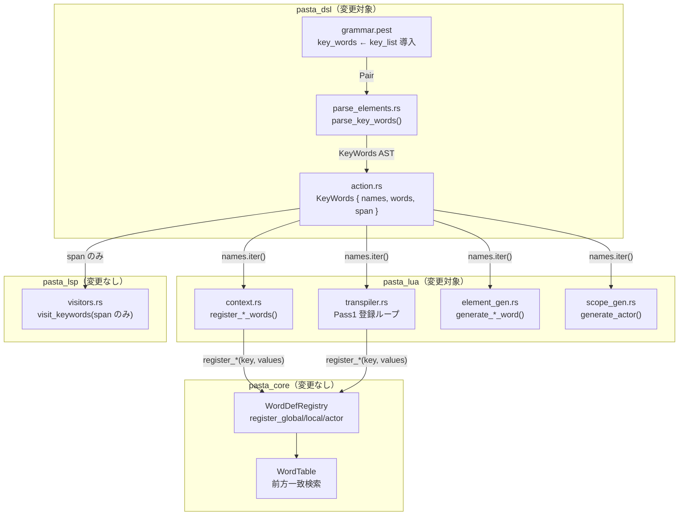
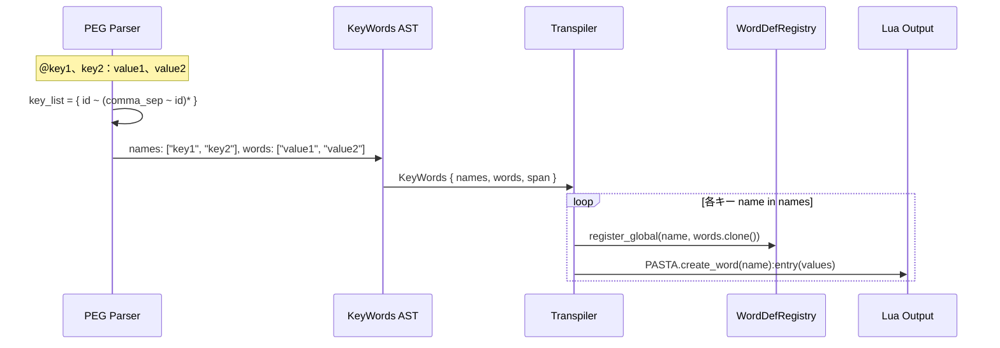
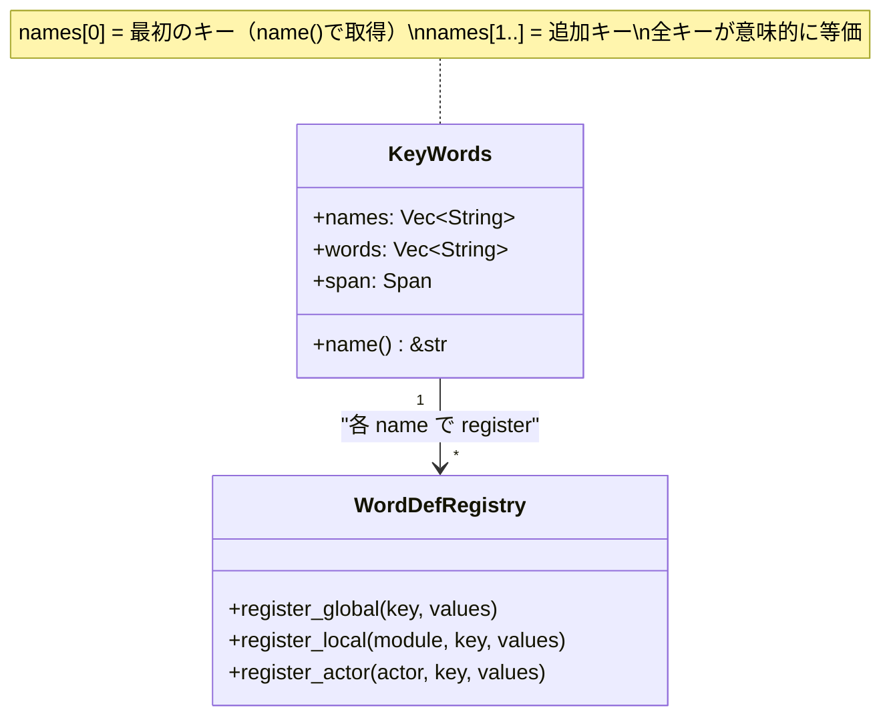

# 設計ドキュメント: word-multi-key

## Overview

**Purpose**: Pasta DSLの単語定義（`＠key：values`）に複数キー構文（`＠key1、key2：values`）を追加し、同一の単語候補群を複数のカテゴリ名で参照可能にする。PEG文法・AST・pasta_luaトランスパイラの3層にわたるエンドツーエンドの拡張。

**Users**: ゴースト作者がPasta DSL辞書ファイル（`.pasta`）を記述する際に使用する。

**Impact**: `key_words` PEGルール・`KeyWords` AST構造体・pasta_luaトランスパイラの単語登録/コード生成処理を変更する。`pasta_core`・`pasta_lsp`は変更不要。

### Goals
- 複数キーの単語定義を文法・AST・トランスパイルの全層でサポート
- 既存の単一キー構文との後方互換性を維持
- 各ステップで `cargo test --all` が通るインクリメンタル実装を可能にする設計

### Non-Goals
- `pasta_core`（`WordDefRegistry`/`WordTable`）の構造変更
- `pasta_lsp` のセマンティックハイライト拡張（キーごとの個別ハイライト）
- 動的単語参照（`＠＄変数`）のサポート
- キーごとの個別Span保持（将来の拡張ポイントとして記録済み、`research.md` 参照）

## Architecture

### Existing Architecture Analysis

現在の単語定義処理は以下の3層パイプラインで動作する:

```
PEG文法 (grammar.pest)
  key_words = { id ~ kv_marker ~ words }
      ↓ パース
AST (action.rs)
  KeyWords { name: String, words: Vec<String>, span: Span }
      ↓ トランスパイル
pasta_lua (transpiler.rs / element_gen.rs / scope_gen.rs / context.rs)
  WordDefRegistry.register_*(key, values)
  Lua出力: PASTA.create_word(key):entry(...)
```

**制約**:
- `key_words` ルールは `file_word_line`・`global_scene_word_line`・`actor_scope_item` の3コンテキストで共有
- `parse_key_words()` は単一関数で全コンテキストを処理
- `KeyWords.name` は7箇所で直接フィールドアクセスされている（pasta_lua内）

### Architecture Pattern & Boundary Map



**Architecture Integration**:
- **Selected pattern**: パイプライン拡張（PEG→AST→Transpiler の各層を同一パターンで拡張）
- **Domain boundaries**: `pasta_dsl`（パース層）と `pasta_lua`（コード生成層）の責務分離を維持
- **Existing patterns preserved**: `comma_sep` ルールの再利用、`parse_*()` 関数パターン、`generate_*()` 関数パターン
- **New components rationale**: 新規コンポーネントなし。既存の構造体・関数の拡張のみ
- **Steering compliance**: tech.md のワークスペースレイヤー構成に準拠

### Technology Stack

| Layer | Choice / Version | Role in Feature | Notes |
|-------|------------------|-----------------|-------|
| Parser | Pest 2.8.6 | PEG文法定義・パース | `key_list` ルール追加 |
| AST | Rust (2024 edition) | 型安全なAST表現 | `KeyWords` 構造体変更 |
| Transpiler | pasta_lua | AST→Lua変換 | 複数キーのイテレーション追加 |
| Registry | pasta_core | 単語登録・検索 | 変更なし（既存APIで対応） |

## System Flows

### 複数キー単語定義の処理フロー



## Requirements Traceability

| Requirement | Summary | Components | Interfaces | Flows |
|-------------|---------|------------|------------|-------|
| 1.1 | 複数キーのパース | PEG `key_list`, `parse_key_words()` | `Rule::key_list` → `Vec<String>` | パースフロー |
| 1.2 | 単一キー後方互換 | PEG `key_list` | 同上 | 同上 |
| 1.3 | 3キー以上対応 | PEG `key_list` | 同上 | 同上 |
| 1.4 | 全角/半角カンマ対応 | PEG `comma_sep`（既存） | 変更なし | — |
| 1.5 | 3コンテキスト自動波及 | `key_words` ルール共有 | 変更なし | — |
| 2.1 | AST複数キー保持 | `KeyWords.names` | `names: Vec<String>` | — |
| 2.2 | 複数キーフィールド | `KeyWords` 構造体 | `names` + `name()` | — |
| 2.3 | 単一キー互換性 | `KeyWords.name()` | `pub fn name() -> &str` | — |
| 2.4 | Span保持 | `KeyWords.span` | 行全体Span維持 | — |
| 2.5 | キーリスト列挙 | `KeyWords.names` | `names.iter()` | — |
| 2.6 | 値リスト共有 | `KeyWords.words` | 単一 `Vec<String>` | — |
| 3.1 | コロンなしエラー | PEG `kv_marker` 要求 | 変更なし | — |
| 3.2 | 空キーエラー | PEG `id` ルール | 変更なし | — |
| 4.1 | レジストリ全キー登録 | `context.rs`, `transpiler.rs` | `names.iter()` ループ | 登録フロー |
| 4.2 | Lua全キー出力 | `element_gen.rs`, `scope_gen.rs` | `names.iter()` ループ | コード生成フロー |
| 4.3 | 単一キー後方互換 | 全pasta_luaコンポーネント | `names.len() == 1` 時の等価出力 | — |
| 4.4 | Registry構造変更なし | pasta_core | 変更なし | — |

## Components and Interfaces

| Component | Domain/Layer | Intent | Req Coverage | Key Dependencies | Contracts |
|-----------|-------------|--------|-------------|-----------------|-----------|
| PEG `key_list` | pasta_dsl/Parser | カンマ区切りキーリストの文法定義 | 1.1–1.5 | `id`, `comma_sep` (P0) | — |
| `KeyWords` AST | pasta_dsl/AST | 複数キー情報を型安全に表現 | 2.1–2.6 | `Span` (P0) | Service |
| `parse_key_words()` | pasta_dsl/Parser | PEG結果→AST変換 | 1.1–1.3, 2.1 | `Rule::key_list` (P0) | Service |
| `register_*_words()` | pasta_lua/Context | 全キーでWordDefRegistry登録 | 4.1, 4.4 | `WordDefRegistry` (P0) | Service |
| `generate_*_word()` | pasta_lua/CodeGen | 全キーでLuaコード出力 | 4.2, 4.3 | `StringLiteralizer` (P0) | Service |
| `generate_actor()` | pasta_lua/CodeGen | アクター単語の全キー出力 | 4.2 | `StringLiteralizer` (P0) | Service |
| Pass1 登録 | pasta_lua/Transpiler | ファイル処理ループ内の全キー登録 | 4.1 | `WordDefRegistry` (P0) | — |

### pasta_dsl / Parser

#### PEG `key_list` ルール

| Field | Detail |
|-------|--------|
| Intent | コロン左側のカンマ区切りキーリストを定義する文法ルール |
| Requirements | 1.1, 1.2, 1.3, 1.4, 1.5 |

**Responsibilities & Constraints**
- `id ~ ( comma_sep ~ id )*` パターンでキーリストをマッチ
- 既存の `comma_sep` ルールを再利用（全角/半角カンマ対応）
- 末尾カンマ非許容（`id` が空文字を拒否するため自動排除）

**Dependencies**
- Inbound: `key_words` ルール — キーリスト部分を委譲 (P0)
- Outbound: `id` — 個別キー識別子 (P0)
- Outbound: `comma_sep` — カンマ区切り (P0)

##### Service Interface

```pest
// 変更前
key_words = { id ~ s ~ kv_marker ~ s ~ words }

// 変更後
key_list  = { id ~ ( comma_sep ~ id )* }
key_words = { key_list ~ s ~ kv_marker ~ s ~ words }
```

- Preconditions: 入力行が `＠` マーカーで開始されている
- Postconditions: `key_list` 内に1つ以上の `id` ペアが存在する
- Invariants: `kv_marker` がキーリストと値リストの境界として機能する

### pasta_dsl / AST

#### `KeyWords` 構造体

| Field | Detail |
|-------|--------|
| Intent | 単語定義の複数キー・値リスト・ソース位置をAST上で表現 |
| Requirements | 2.1, 2.2, 2.3, 2.4, 2.5, 2.6 |

**Responsibilities & Constraints**
- `names: Vec<String>` — 全キーを等価に保持（最低1要素保証）
- `words: Vec<String>` — 値リスト（全キー間で共有、複製なし）
- `span: Span` — 行全体のソース位置
- `name()` ヘルパーで最初のキー名を返す（単一キー時の利便性）

**Dependencies**
- Inbound: `parse_key_words()` — AST構築 (P0)
- Outbound: `Span` — ソース位置型 (P0)

##### Service Interface

```rust
/// Word definition for random selection.
///
/// Corresponds to the `key_words` rule: `@key1、key2：word1、word2、...`
#[derive(Debug, Clone)]
pub struct KeyWords {
    /// Key name list (at least one element guaranteed)
    pub names: Vec<String>,
    /// List of word values
    pub words: Vec<String>,
    /// Source location
    pub span: Span,
}

impl KeyWords {
    /// Returns the first (primary) key name.
    ///
    /// Equivalent to the former `name` field for backward compatibility.
    pub fn name(&self) -> &str {
        &self.names[0]
    }
}
```

- Preconditions: `names` は1要素以上（PEG `key_list` = `id ~ ...` により保証）
- Postconditions: `name()` は常に有効な文字列参照を返す
- Invariants: `words` は全キーで共有される単一リスト

### pasta_dsl / Parser

#### `parse_key_words()` 関数

| Field | Detail |
|-------|--------|
| Intent | PEG `key_words` ルールのマッチ結果をAST `KeyWords` に変換 |
| Requirements | 1.1, 1.2, 1.3, 2.1 |

**Responsibilities & Constraints**
- `Rule::key_list` 内の全 `Rule::id` を `names` に収集
- `Rule::words` 内の各値を `words` に収集（既存ロジック維持）
- 行全体の `Span` を保持

**Dependencies**
- Inbound: パーサーメインループ — `Rule::key_words` ペア (P0)
- Outbound: `KeyWords` AST構造体 (P0)

##### Service Interface

```rust
/// Parse key_words.
pub(crate) fn parse_key_words(pair: Pair<Rule>) -> Result<KeyWords, ParseError> {
    let span = Span::from(&pair.as_span());
    let mut names = Vec::new();
    let mut words = Vec::new();

    for inner in pair.into_inner() {
        match inner.as_rule() {
            Rule::key_list => {
                for key_inner in inner.into_inner() {
                    if key_inner.as_rule() == Rule::id {
                        names.push(key_inner.as_str().to_string());
                    }
                }
            }
            Rule::words => {
                // 既存の値パースロジック（変更なし）
            }
            _ => {}
        }
    }

    Ok(KeyWords { names, words, span })
}
```

- Preconditions: `pair` は `Rule::key_words` のマッチ結果
- Postconditions: `names` は1要素以上、`words` は0要素以上
- Invariants: 単一キー入力時、`names.len() == 1`

### pasta_lua / Context

#### `register_*_words()` 関数群

| Field | Detail |
|-------|--------|
| Intent | `KeyWords` AST の全キーに対して `WordDefRegistry` への登録を実行 |
| Requirements | 4.1, 4.3, 4.4 |

**Responsibilities & Constraints**
- `kw.names.iter()` で全キーをイテレーション
- 各キーに対して `register_global` / `register_local` を呼び出し
- `words` は `clone()` で渡す（既存パターン維持）

**Dependencies**
- Inbound: `transpile()` / コンテキスト構築 — `KeyWords` AST (P0)
- Outbound: `WordDefRegistry` — 単語登録 (P0)

##### Service Interface

```rust
pub fn register_global_words(&mut self, words: &[KeyWords]) {
    for kw in words {
        for name in &kw.names {
            self.word_registry
                .register_global(name, kw.words.clone());
        }
    }
}

pub fn register_local_words(&mut self, words: &[KeyWords], module_name: &str) {
    for kw in words {
        for name in &kw.names {
            self.word_registry
                .register_local(module_name, name, kw.words.clone());
        }
    }
}
```

- Preconditions: `kw.names` は1要素以上
- Postconditions: 各キーが `WordDefRegistry` に登録されている
- Invariants: `WordDefRegistry` の構造は変更しない

### pasta_lua / CodeGen

#### `generate_global_word()` / `generate_local_word()`

| Field | Detail |
|-------|--------|
| Intent | 全キーに対して `create_word(key):entry(...)` のLuaコードを出力 |
| Requirements | 4.2, 4.3 |

**Responsibilities & Constraints**
- `word.names.iter()` で全キーをイテレーション
- 各キーに対して `PASTA.create_word(key):entry(...)` / `SCENE:create_word(key):entry(...)` を出力
- 値リスト（`entry(...)` 部分）は全キーで共通

**Dependencies**
- Inbound: `transpile()` — `KeyWords` AST (P0)
- Outbound: `StringLiteralizer` — 文字列リテラル化 (P0)

##### Service Interface

```rust
pub fn generate_global_word(&mut self, word: &KeyWords) -> Result<(), TranspileError> {
    if word.words.is_empty() {
        return Ok(());
    }
    let values: Vec<String> = word.words.iter()
        .map(|w| StringLiteralizer::literalize(w))
        .collect::<Result<Vec<_>, _>>()?;
    let entry = values.join(", ");

    for name in &word.names {
        self.writeln(&format!(
            "PASTA.create_word({}):entry({})",
            StringLiteralizer::literalize(name)?,
            entry
        ))?;
    }
    Ok(())
}

pub fn generate_local_word(&mut self, word: &KeyWords) -> Result<(), TranspileError> {
    if word.words.is_empty() {
        return Ok(());
    }
    let values: Vec<String> = word.words.iter()
        .map(|w| StringLiteralizer::literalize(w))
        .collect::<Result<Vec<_>, _>>()?;
    let entry = values.join(", ");

    for name in &word.names {
        self.writeln(&format!(
            "SCENE:create_word({}):entry({})",
            StringLiteralizer::literalize(name)?,
            entry
        ))?;
    }
    Ok(())
}
```

#### `generate_actor()`

| Field | Detail |
|-------|--------|
| Intent | アクター辞書内の全キーに対して `ACTOR:create_word(key):entry(...)` を出力 |
| Requirements | 4.2 |

**Responsibilities & Constraints**
- `word_def.names.iter()` で全キーをイテレーション
- 各キーに対して `ACTOR:create_word(key):entry(...)` を出力

##### Service Interface

```rust
// generate_actor() 内の単語定義ループ:
for word_def in &actor.words {
    if word_def.words.is_empty() {
        continue;
    }
    let literals: Result<Vec<String>, _> = word_def.words.iter()
        .map(|w| StringLiteralizer::literalize_with_span(w, &word_def.span))
        .collect();
    let literals = literals?;
    let entry_args = literals.join(", ");

    for name in &word_def.names {
        self.writeln(&format!(
            "ACTOR:create_word(\"{}\"):entry({})",
            name, entry_args
        ))?;
    }
}
```

### pasta_lua / Transpiler

#### Pass1 ファイル処理ループ

| Field | Detail |
|-------|--------|
| Intent | `FileItem::GlobalWord` / `FileItem::ActorScope` 内の全キーで `WordDefRegistry` 登録 |
| Requirements | 4.1 |

**Responsibilities & Constraints**
- `word.names.iter()` でグローバル単語の全キーを登録
- アクタースコープ内でも `word_def.names.iter()` で全キーを登録

##### Service Interface

```rust
// transpiler.rs 内:
FileItem::GlobalWord(word) => {
    for name in &word.names {
        let values: Vec<String> = word.words.clone();
        context.word_registry.register_global(name, values);
    }
    codegen.generate_global_word(word)?;
}

FileItem::ActorScope(actor) => {
    for word_def in &actor.words {
        for name in &word_def.names {
            let values: Vec<String> = word_def.words.clone();
            context.word_registry.register_actor(&actor.name, name, values);
        }
    }
    codegen.generate_actor(actor)?;
}
```

## Data Models

### Domain Model



**変更前**: `KeyWords` は `name: String`（1つのキー）→ `WordDefRegistry` に1回登録

**変更後**: `KeyWords` は `names: Vec<String>`（N個のキー）→ `WordDefRegistry` にN回登録（同一 `words` で）

**ビジネスルール**: 全キーは意味的に対等。最初のキーが「メイン」で残りが「エイリアス」ではない。`name()` ヘルパーは利便性のみを目的とし、セマンティック的な優先順位を暗示しない。
