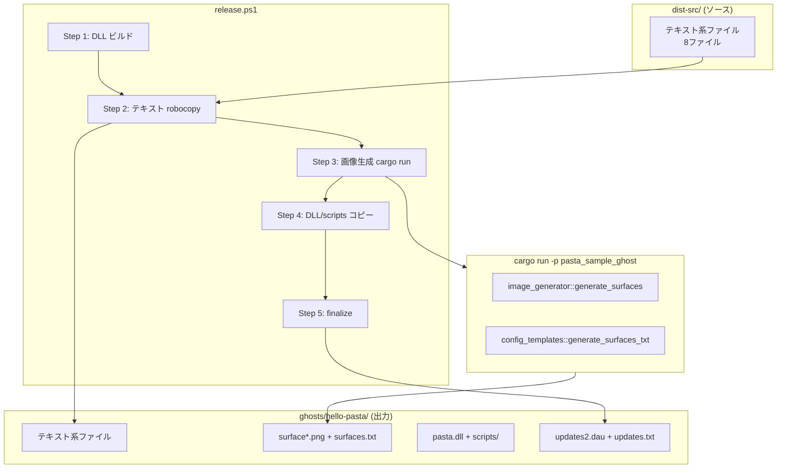
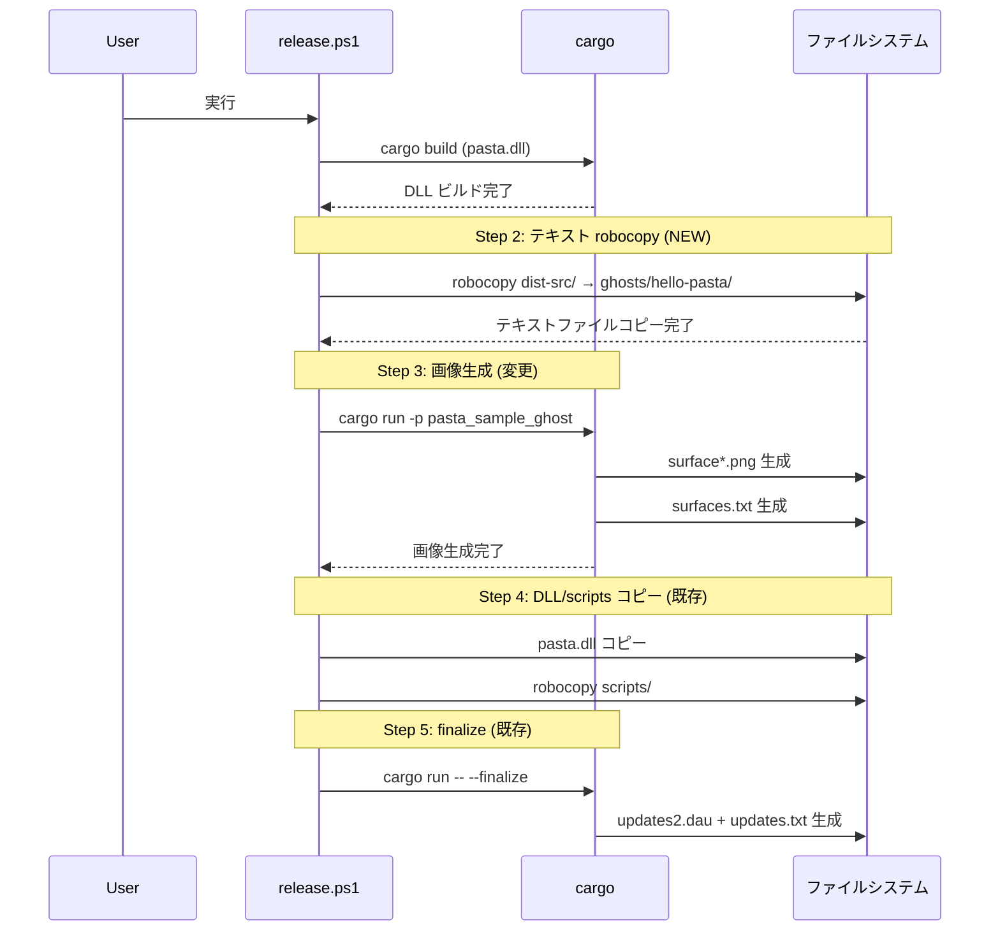

# Design Document: xcopy-text-files

## Overview

**Purpose**: pasta_sample_ghost クレートのテキスト系配布ファイル（設定ファイル4種＋pasta DSLスクリプト4種）を、Rustコード内の定数・テンプレートによる動的生成から、クレート内の専用ディレクトリに配置された実ファイルの xcopy（robocopy）コピーに移行する。

**Users**: ゴースト開発者が pasta DSL スクリプトや設定ファイルを編集する際、Rust の再コンパイルを不要にする。リリース担当者は release.ps1 の実行フローに沿って配布物を構築する。

**Impact**: `config_templates.rs` のテンプレート置換ロジックと `scripts.rs` のハードコード定数を廃止し、`generate_ghost()` の責務を画像生成＋surfaces.txt に縮小する。release.ps1 に robocopy ステップを追加する。

### Goals
- テキスト系ファイルの編集に Rust 再コンパイルを不要にする
- `dist-src/` ディレクトリに配布物構造をミラーした最終形ファイルを配置する
- release.ps1 で正しい順序（テキスト xcopy → 画像生成 → DLL/scripts コピー → finalize）を実現する
- 既存テストの全パスを維持する

### Non-Goals
- 画像生成（surface*.png）のフロー変更
- surfaces.txt のコード生成廃止（画像IDとの整合性維持のため継続）
- `GhostConfig` 構造体の削除（API 互換性維持）
- release.ps1 の Release Phase（Step 5-8）の変更

## Architecture

### Existing Architecture Analysis

現在の配布物生成は以下の単一パイプラインで実行される:

```
cargo run -p pasta_sample_ghost
  → generate_ghost()
    → config_templates::generate_structure()  [テキスト＋ディレクトリ]
    → image_generator::generate_surfaces()    [画像]
    → scripts::generate_scripts()             [DSLスクリプト]
```

**変更後**: テキスト生成を `cargo run` から分離し、release.ps1 の robocopy に移行する。

### Architecture Pattern & Boundary Map



**Architecture Integration**:
- Selected pattern: ソースファイル直接配置＋ robocopy コピー（Option B: 完全外部化）
- Domain/feature boundaries: テキスト配布 = ファイルシステム操作（release.ps1）、画像配布 = Rust コード生成（cargo run）
- Existing patterns preserved: robocopy による scripts/ コピー（既存 Step 3 のパターン流用）
- New components rationale: `dist-src/` ディレクトリ — テキスト系ファイルの Single Source of Truth
- Steering compliance: SOUL.md の「段階的な品質向上」に沿った小規模リファクタリング

### Technology Stack

| Layer | Choice / Version | Role in Feature | Notes |
|-------|------------------|-----------------|-------|
| Build Script | PowerShell / release.ps1 | テキスト robocopy ステップの追加 | robocopy パターンは既存 Step 3 を流用 |
| Runtime | Rust 2024 edition | 画像＋surfaces.txt 生成のみ | `generate_ghost()` 責務縮小 |
| File Copy | robocopy (Windows 標準) | `dist-src/` → `ghosts/hello-pasta/` | `/E` フラグ使用（詳細は research.md） |

## System Flows

### release.ps1 の新しい実行フロー



## Requirements Traceability

| Requirement | Summary | Components | Interfaces | Flows |
|-------------|---------|------------|------------|-------|
| 1.1 | 専用ディレクトリ `dist-src/` の導入 | dist-src ディレクトリ | — | — |
| 1.2 | 直感的な名称 | dist-src ディレクトリ | — | — |
| 1.3 | 配布構造ミラー | dist-src ディレクトリ | — | — |
| 2.1 | .pasta ファイル robocopy | release.ps1, dist-src | robocopy | release フロー Step 2 |
| 2.2 | scripts.rs 定数廃止 | scripts.rs | — | — |
| 3.1 | pasta.toml 最終形 | dist-src/ghost/master/pasta.toml | — | — |
| 3.2 | ghost descript.txt 最終形 | dist-src/ghost/master/descript.txt | — | — |
| 3.3 | install.txt 最終形 | dist-src/install.txt | — | — |
| 3.4 | shell descript.txt 最終形 | dist-src/shell/master/descript.txt | — | — |
| 4.1 | 実行順序の保証 | release.ps1 | — | release フロー全体 |
| 4.2 | テキスト robocopy 実行 | release.ps1 | robocopy | release フロー Step 2 |
| 4.3 | 画像生成をテキスト後に | release.ps1 | cargo run | release フロー Step 3 |
| 4.4 | DLL/scripts を画像後に | release.ps1 | — | release フロー Step 4 |
| 4.5 | dist-src 不在時エラー | release.ps1 | — | — |
| 5.1 | 全テストパス | テスト全般 | — | — |
| 5.2 | scripts.rs テスト適応 | scripts.rs テスト | — | — |
| 5.3 | config_templates テスト適応 | config_templates.rs テスト, integration_test.rs | — | — |
| 6.1 | image_generator 維持 | image_generator.rs | — | — |
| 6.2 | surfaces.txt 生成維持 | config_templates.rs | — | — |
| 6.3 | cargo run は画像のみ | lib.rs, main.rs | generate_ghost() | — |
| 6.4 | 実行順序整合性 | release.ps1 | — | release フロー |

## Components and Interfaces

| Component | Domain/Layer | Intent | Req Coverage | Key Dependencies | Contracts |
|-----------|-------------|--------|--------------|-----------------|-----------|
| dist-src ディレクトリ | ファイルシステム | テキスト系配布ファイルの Single Source of Truth | 1.1-1.3, 3.1-3.4 | — | — |
| release.ps1 | ビルドスクリプト | テキスト robocopy ステップの追加と実行順序制御 | 4.1-4.5, 2.1 | dist-src (P0), cargo (P0), robocopy (P0) | — |
| lib.rs / generate_ghost() | Rust ライブラリ | 画像＋surfaces.txt 生成のみに責務縮小 | 6.1-6.4 | image_generator (P0), config_templates (P0) | Service |
| config_templates.rs | Rust ライブラリ | surfaces.txt 生成のみ残し、テンプレート関連コードを削除 | 6.2, 3.1-3.4 | — | Service |
| scripts.rs | Rust ライブラリ | ハードコード定数を削除、テスト用ファイル読み込みに移行 | 2.2, 5.2 | dist-src (テスト時 P1) | — |
| main.rs | Rust バイナリ | コンソール出力を画像生成のみに更新 | 6.3 | lib.rs (P0) | — |
| integration_test.rs | テスト | 新しい生成範囲に合わせたテスト更新 | 5.1, 5.3 | lib.rs (P0), dist-src (P1) | — |
| templates/ | ファイルシステム | 廃止（dist-src 初期化完了後に削除） | 3.1-3.4 | — | — |

### ファイルシステム層

#### dist-src ディレクトリ

| Field | Detail |
|-------|--------|
| Intent | テキスト系配布ファイルの Single Source of Truth として、ghosts/hello-pasta/ の構造をミラーする |
| Requirements | 1.1, 1.2, 1.3, 3.1, 3.2, 3.3, 3.4 |

**Responsibilities & Constraints**
- `crates/pasta_sample_ghost/dist-src/` に配置
- 配布先 `ghosts/hello-pasta/` のディレクトリ構造をそのままミラー
- すべてのファイルはプレースホルダーなしの最終形

**ディレクトリ構造**:
```
crates/pasta_sample_ghost/dist-src/
├── install.txt
├── ghost/
│   └── master/
│       ├── descript.txt
│       ├── pasta.toml
│       └── dic/
│           ├── actors.pasta
│           ├── boot.pasta
│           ├── talk.pasta
│           └── click.pasta
└── shell/
    └── master/
        └── descript.txt
```

**Implementation Notes**
- 各ファイルの内容は現在のテンプレート展開結果・定数値と完全一致させる（`GhostConfig::default()` の値を埋め込み済み）
- `shell/master/surfaces.txt` は **含めない**（`cargo run` でコード生成）
- `shell/master/surface*.png` は **含めない**（`cargo run` で画像生成）

**初期化手順（タスク実装時に決定）**:
- `dist-src/` の8ファイルは、実装フェーズで以下のいずれかの方法で初期作成する:
  1. PowerShell スクリプト（`setup-dist-src.ps1`）でテンプレート展開
  2. Rust ユーティリティコマンド（`cargo run -- --setup-dist-src`）
  3. 手動作成（各ファイル内容を design.md または別ドキュメントに全文記載）
- 初期化完了後、`templates/` ディレクトリを削除
- 初期化正確性の検証: 移行前の `cargo run` 出力と `dist-src/` ファイルの完全一致を確認するテストを追加

### ビルドスクリプト層

#### release.ps1

| Field | Detail |
|-------|--------|
| Intent | テキスト robocopy ステップを追加し、Setup Phase の実行順序を再構成する |
| Requirements | 2.1, 4.1, 4.2, 4.3, 4.4, 4.5 |

**Responsibilities & Constraints**
- Step 2（新規）: `dist-src/` → `ghosts/hello-pasta/` の robocopy
- Step 3（変更）: `cargo run -p pasta_sample_ghost`（画像生成のみ）
- Step 4（既存変更なし）: pasta.dll + scripts/ コピー
- Step 5（既存変更なし）: finalize
- ステップ番号は 8→9 に増加

**Dependencies**
- Inbound: dist-src ディレクトリ — テキストファイルのソース (P0)
- Outbound: ghosts/hello-pasta/ — 配布物出力先 (P0)
- External: robocopy — Windows 標準ツール (P0)

**Contracts**: Batch [ ✓ ]

##### Batch / Job Contract
- Trigger: `powershell -ExecutionPolicy Bypass -File release.ps1`
- Input / validation: `dist-src/` ディレクトリの存在確認（不在時はエラー終了）
- Output / destination: `ghosts/hello-pasta/` にテキストファイルがコピーされた状態
- Idempotency & recovery: robocopy `/E` は冪等（既存ファイルを上書き）

**新 Step 2 の robocopy コマンド**:
```powershell
$DistSrcDir = Join-Path $ScriptDir "dist-src"
$robocopyTextArgs = @(
    $DistSrcDir,
    $GhostDir,
    "/E",
    "/NJH", "/NJS", "/NDL", "/NC", "/NS", "/NP"
)
& robocopy @robocopyTextArgs | Out-Null
```

**Implementation Notes**
- `/E` フラグを使用（`/MIR` は画像ファイルを削除してしまうため不可）
- `dist-src/` 不在チェックは `Test-Path` で実装、エラー時は `exit 1`
- Setup Phase 全体のステップ番号を再採番: 1(DLL) → 2(テキスト) → 3(画像) → 4(DLL/scripts) → 5(finalize) → 6-9(Release)

### Rust ライブラリ層

#### lib.rs / generate_ghost()

| Field | Detail |
|-------|--------|
| Intent | テキスト生成呼び出しを削除し、画像生成＋surfaces.txt のみに責務を縮小する |
| Requirements | 6.1, 6.2, 6.3, 6.4 |

**Responsibilities & Constraints**
- `config_templates::generate_structure()` 呼び出しを削除
- `scripts::generate_scripts()` 呼び出しを削除
- ディレクトリ作成（`shell/master/`）は画像生成前に必要なため残す
- `generate_surfaces_txt()` は `shell/master/surfaces.txt` として出力

**Contracts**: Service [ ✓ ]

##### Service Interface
```rust
/// ゴースト配布物を生成（画像＋surfaces.txt のみ）
pub fn generate_ghost(output_dir: &Path, config: &GhostConfig) -> Result<(), GhostError> {
    // ディレクトリ作成
    let shell_dir = output_dir.join("shell/master");
    fs::create_dir_all(&shell_dir)?;

    // シェル画像を生成
    image_generator::generate_surfaces(&shell_dir)?;

    // surfaces.txt を生成
    fs::write(
        shell_dir.join("surfaces.txt"),
        config_templates::generate_surfaces_txt(),
    )?;

    Ok(())
}
```
- Preconditions: `output_dir` が書き込み可能であること
- Postconditions: `shell/master/surface*.png` 18ファイル＋`shell/master/surfaces.txt` が生成される
- Invariants: `GhostConfig` 引数は互換性のために保持するが内部では未使用

**Implementation Notes**
- `GhostConfig` 引数を削除すると API 破壊的変更になるため、シグネチャは維持（`_config` にリネーム可）
- `ghost/master/dic/` ディレクトリ作成は不要になる（テキスト xcopy で作成済み）

#### config_templates.rs

| Field | Detail |
|-------|--------|
| Intent | テンプレート置換ロジックを全削除し、`generate_surfaces_txt()` のみ残す |
| Requirements | 6.2, 3.1-3.4 |

**Responsibilities & Constraints**
- 削除対象: `INSTALL_TXT_TEMPLATE`, `GHOST_DESCRIPT_TEMPLATE`, `SHELL_DESCRIPT_TEMPLATE`, `PASTA_TOML_TEMPLATE` 定数
- 削除対象: `generate_structure()`, `generate_install_txt()`, `generate_ghost_descript()`, `generate_shell_descript()`, `generate_pasta_toml()` 関数
- 残存: `generate_surfaces_txt()` 関数（Req 6.2）
- テスト: `test_install_txt`, `test_ghost_descript`, `test_pasta_toml` を削除。`test_surfaces_txt` を残す

**Implementation Notes**
- `use crate::{GhostConfig, GhostError};` → `GhostConfig` の import は削除
- `use std::fs;`, `use std::path::Path;` → 不要になるため削除
- モジュールの doc comment を更新（「surfaces.txt 生成」に変更）

#### scripts.rs

| Field | Detail |
|-------|--------|
| Intent | ハードコード定数 `ACTORS_PASTA` 等を削除し、テストはファイル読み込みに移行 |
| Requirements | 2.2, 5.2 |

**Responsibilities & Constraints**
- 削除対象: `ACTORS_PASTA`, `BOOT_PASTA`, `TALK_PASTA`, `CLICK_PASTA` 定数
- 削除対象: `generate_scripts()` 関数
- テスト: ファイル読み込みヘルパーを導入し、`dist-src/` からファイルを読む方式に変更

**テストのファイル読み込み方式**:
```rust
#[cfg(test)]
mod tests {
    use std::path::PathBuf;

    /// dist-src ディレクトリのパスを取得
    fn dist_src_dir() -> PathBuf {
        PathBuf::from(env!("CARGO_MANIFEST_DIR")).join("dist-src")
    }

    /// dist-src からスクリプトファイルを読み込む
    fn read_pasta_script(name: &str) -> String {
        let path = dist_src_dir()
            .join("ghost/master/dic")
            .join(name);
        std::fs::read_to_string(&path)
            .unwrap_or_else(|e| panic!("{} の読み込みに失敗: {}", name, e))
    }

    #[test]
    fn test_actors_pasta_contains_all_characters() {
        let actors = read_pasta_script("actors.pasta");
        assert!(actors.contains("％女の子"));
        assert!(actors.contains("％男の子"));
        // ...
    }
}
```

**Implementation Notes**
- `env!("CARGO_MANIFEST_DIR")` は `cargo test` 実行時にクレートルートに解決される
- テストパターンは「定数参照 → ファイル読み込み」の機械的置換
- `pub const` → 削除、`pub fn generate_scripts()` → 削除

#### main.rs

| Field | Detail |
|-------|--------|
| Intent | コンソール出力メッセージを画像生成のみに更新 |
| Requirements | 6.3 |

**Responsibilities & Constraints**
- `run_generate_mode()` のメッセージを画像生成のみを反映した内容に更新
- doc comment の「生成されるファイル」セクションからテキストファイルを除去
- 動作自体は `generate_ghost()` の変更に追従するため、`main.rs` 自体の大きな変更は不要

### テスト層

#### integration_test.rs

| Field | Detail |
|-------|--------|
| Intent | `generate_ghost()` の責務縮小に合わせてテストを更新 |
| Requirements | 5.1, 5.3 |

**Responsibilities & Constraints**
- `test_directory_structure`: 画像＋surfaces.txt の存在確認のみに縮小。テキストファイルは `dist-src/` の存在確認テストに変更
- `test_pasta_toml_content`: `dist-src/` のファイルを直接読み込んで検証する方式に変更
- `test_ukadoc_files`: 同上
- `test_pasta_scripts`: `dist-src/` のファイルを直接読み込んで検証
- `test_random_talk_patterns`, `test_hour_chime_patterns`: `scripts::TALK_PASTA` → ファイル読み込みに変更
- `test_shell_images`, `test_image_dimensions`, `test_expression_variations`: 変更なし

**Implementation Notes**
- テキスト系テストは `generate_ghost()` を呼ばずに `dist-src/` を直接検証する方式に移行
- 画像系テストは `generate_ghost()` を引き続き使用
- `test_directory_structure` は以下の2テストに分割:
  1. **`test_dist_src_directory_structure`**: `dist-src/` の8ファイル存在確認（`fs::metadata` による静的検証、`generate_ghost()` 呼び出し不要）
  2. **`test_generated_images_structure`**: `generate_ghost()` 経由で `shell/master/*.png` 18ファイル＋`surfaces.txt` 生成確認（既存ロジック流用）
- 配置: `test_dist_src_directory_structure` は新規ファイル `crates/pasta_sample_ghost/tests/dist_src_validation_test.rs` に分離（既存 `integration_test.rs` から独立）

## Error Handling

### Error Strategy
- `dist-src/` ディレクトリ不在: release.ps1 で `Test-Path` チェック → エラーメッセージ + `exit 1`
- robocopy 失敗: 終了コード 8 以上で検出 → エラーメッセージ + `exit 1`（既存パターン踏襲）
- テストのファイル読み込み失敗: `unwrap_or_else` で panic（テスト文脈では適切）

## Testing Strategy

### Unit Tests
- `config_templates.rs::test_surfaces_txt`: surfaces.txt のサーフェスID列挙を検証（維持）
- `scripts.rs` テスト群（6テスト）: ファイル読み込み方式に変更して全テスト維持
  - `test_actors_pasta_contains_all_characters`
  - `test_boot_pasta_contains_events`
  - `test_talk_pasta_contains_events`
  - `test_click_pasta_contains_events`
  - `test_script_expression_names_defined_in_actors`
  - `test_event_files_do_not_contain_global_actor_dictionary`

### Integration Tests
- `test_directory_structure`: 分割 — テキスト（dist-src 直接検証）＋画像（generate_ghost 経由）
- `test_shell_images`: 変更なし（画像生成テスト）
- `test_pasta_toml_content`: dist-src ファイル直接読み込みに変更
- `test_ukadoc_files`: dist-src ファイル直接読み込みに変更
- `test_pasta_scripts`: dist-src ファイル直接読み込みに変更
- `test_random_talk_patterns`: ファイル読み込みに変更
- `test_hour_chime_patterns`: ファイル読み込みに変更
- `test_image_dimensions`, `test_expression_variations`: 変更なし
