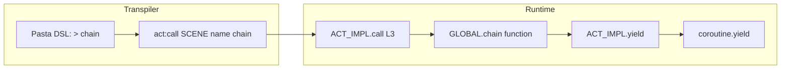
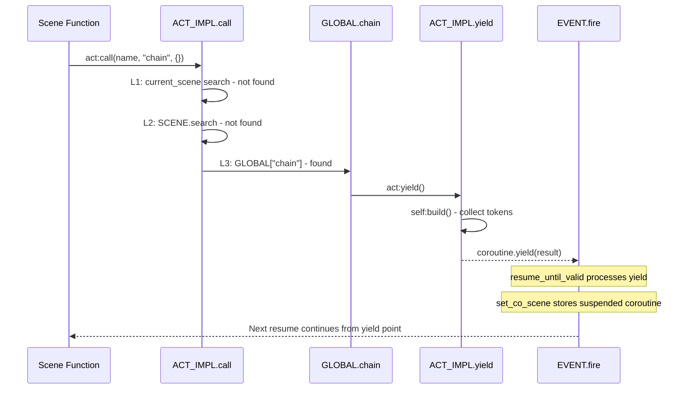

# Technical Design: yield-continuation-token

## Overview

本機能は、Pasta DSL の `＞チェイン` / `＞yield` 構文による**継続トーク（チェイントーク）**を実現する。`pasta.global` モジュールの GLOBAL テーブルにデフォルト関数を事前登録し、ユーザーが Pasta DSL 内で `＞チェイン` と記述するだけで `act:yield()` が実行され、コルーチンの中間出力による会話分割を可能にする。

**Users**: ゴースト作者が Pasta DSL でシーンを記述する際に利用する。
**Impact**: `global.lua`（空テーブル）に関数定義を追加。既存コードの変更なし。

### Goals
- `＞チェイン` / `＞yield` で継続トーク動作を実現する
- 既存の4段階検索ルールとの完全な整合性を維持する
- ユーザーによるオーバーライドを自然にサポートする

### Non-Goals
- `ACT_IMPL.call` の検索ロジック変更
- `ACT_IMPL.yield` や `SCENE.co_exec` の動作変更
- 新規 Lua モジュールやファイルの追加
- Rust 側のコード変更

## Architecture

### Existing Architecture Analysis

変更対象は `scripts/pasta/global.lua` の1ファイルのみ。既存アーキテクチャへの影響はない。

**既存の制御フロー**:
1. トランスパイラが `＞チェイン` → `act:call(SCENE.__global_name__, "チェイン", {}, table.unpack(args))` を生成
2. `ACT_IMPL.call` が L1 → L2 → **L3（GLOBAL テーブル）** → L4 の順で検索
3. `GLOBAL["チェイン"]` が見つかり、`handler(act, ...)` として実行
4. ハンドラー内で `act:yield()` → `self:build()` → `coroutine.yield(result)` を実行
5. `EVENT.fire` の `resume_until_valid` がコルーチン yield を受け取り、中間出力として処理

上記フローにおいて、手順1, 2, 4, 5 はすべて既存実装で充足済み。本機能が追加するのは手順3の **GLOBAL テーブルへの関数登録**（手順2と3の間をつなぐ部分）のみ。

### Architecture Pattern & Boundary Map

**Architecture Integration**:
- **Selected pattern**: 既存モジュール拡張（global.lua への関数追加）
- **Domain boundaries**: 変更なし。GLOBAL テーブルは `act.lua` から L3 で参照される既存境界
- **Existing patterns preserved**: UPPER_CASE テーブル + `return MOD` パターン、`function(act, ...)` シグネチャ
- **New components rationale**: 新コンポーネントなし
- **Steering compliance**: lua-coding.md の命名規約・モジュール構造規約に完全準拠

### Technology Stack

| Layer | Choice / Version | Role in Feature | Notes |
|-------|------------------|-----------------|-------|
| Runtime | Lua 5.5 (mlua 0.11) | GLOBAL テーブルへの関数登録、コルーチン yield 実行 | 変更なし |
| Test | lua_test BDD フレームワーク | Lua BDD テスト | 既存フレームワーク利用 |

## System Flows

### 継続トーク実行フロー

## Requirements Traceability

| Requirement | Summary | Components | Interfaces | Flows |
|-------------|---------|------------|------------|-------|
| 1.1 | GLOBAL.チェイン / GLOBAL.yield 関数提供 | GlobalModule | GLOBAL テーブルエントリ | — |
| 1.2 | act:yield() 実行による中間出力 | GlobalModule | ACT_IMPL.yield（既存） | 継続トークフロー |
| 1.3 | ACT_IMPL.call L3 での解決 | — (既存充足) | ACT_IMPL.call（既存） | 継続トークフロー |
| 1.4 | ユーザーオーバーライド | — (既存充足) | Lua モジュールキャッシュ（既存） | — |
| 2.1 | `＞チェイン` → GLOBAL.チェイン 呼び出し検証 | GlobalChainCallTest | — | — |
| 2.2 | act:yield() 実行と蓄積トークン出力検証 | GlobalChainCallTest | — | — |
| 2.3 | テストフロー自動実行 | GlobalChainCallTest | — | — |
| 2.4 | コルーチン内での yield/resume 検証 | GlobalChainCallTest | — | — |
| 3.1 | EVENT.fire 経由でコルーチン2回 resume | GlobalChainIntegrationTest | — | 継続トークフロー |
| 3.2 | 1回目 resume の中間出力検証 | GlobalChainIntegrationTest | — | — |
| 3.3 | 2回目 resume の最終出力検証 | GlobalChainIntegrationTest | — | — |
| 3.4 | テスト実施方法の設計 | GlobalChainIntegrationTest | — | — |

## Components and Interfaces

| Component | Domain/Layer | Intent | Req Coverage | Key Dependencies (P0/P1) | Contracts |
|-----------|--------------|--------|--------------|--------------------------|-----------|
| GlobalModule | Runtime/Lua | GLOBAL テーブルへのデフォルト関数登録 | 1.1, 1.2 | ACT_IMPL.yield (P0) | State |
| GlobalChainCallTest | Test/Lua BDD | GLOBAL.チェイン の call 解決と yield 動作検証 | 2.1, 2.2, 2.3, 2.4 | ACT, GLOBAL, SCENE (P0) | — |
| GlobalChainIntegrationTest | Test/Lua BDD | EVENT.fire 経由のコルーチン分割検証 | 3.1, 3.2, 3.3, 3.4 | EVENT, STORE, GLOBAL (P0) | — |

### Runtime / Lua

#### GlobalModule

| Field | Detail |
|-------|--------|
| Intent | GLOBAL テーブルにデフォルトの継続トーク関数を登録する |
| Requirements | 1.1, 1.2 |

**Responsibilities & Constraints**
- `GLOBAL.チェイン` と `GLOBAL.yield` の2つの関数を定義
- 両関数は同一動作: `act:yield()` を呼び出す
- 関数シグネチャ: `function(act)` — `ACT_IMPL.call` が第1引数に act オブジェクトを渡す
- 既存の空テーブル + `return GLOBAL` パターンを維持

**Dependencies**
- Inbound: `act.lua` — `require("pasta.global")` で GLOBAL テーブルを取得し L3 検索に使用 (P0)
- Outbound: なし（`act:yield()` は act オブジェクトのメソッドとして呼び出されるため、require 不要）

**Contracts**: State [x]

##### State Management
- **State model**: `GLOBAL` テーブルに `チェイン` と `yield` キーで関数を保持
- **Persistence**: なし（モジュールロード時に定義、`require` キャッシュで保持）
- **Concurrency strategy**: 単一スレッド（Lua VM）

**Implementation Notes**
- **Integration**: `global.lua` の `local GLOBAL = {}` と `return GLOBAL` の間に関数定義を追加するのみ
- **Validation**: `act:yield()` が呼び出されることを Lua BDD テストで検証
- **Risks**: なし（既存パターン完全準拠、変更量最小）

### Test / Lua BDD

#### GlobalChainCallTest

| Field | Detail |
|-------|--------|
| Intent | `ACT_IMPL.call` L3 経由で GLOBAL.チェイン が呼ばれ、act:yield() が実行されることを検証 |
| Requirements | 2.1, 2.2, 2.3, 2.4 |

**Responsibilities & Constraints**
- テストファイル: `tests/lua_specs/global_chain_call_test.lua`
- `init.lua` の specs テーブルに `"global_chain_call_test"` を追加
- 既存の `act_impl_call_test.lua` の L3 テストパターンを踏襲
- テスト対象: GLOBAL.チェイン / GLOBAL.yield の関数登録、call 解決、yield 動作

**Dependencies**
- External: `lua_test.test` — BDD テストフレームワーク (P0)
- External: `pasta.act` — ACT モジュール (P0)
- External: `pasta.global` — GLOBAL テーブル (P0)

**テストケース設計**

| # | テストケース | 検証内容 | Req |
|---|-------------|---------|-----|
| 1 | GLOBAL.チェイン が登録されている | `GLOBAL["チェイン"]` が非 nil の関数であること | 2.1 |
| 2 | GLOBAL.yield が登録されている | `GLOBAL["yield"]` が非 nil の関数であること | 2.1 |
| 3 | act:call で GLOBAL.チェイン が L3 解決される | current_scene=nil の act で `act:call(nil, "チェイン", {})` → yield 動作 | 2.1 |
| 4 | act:call で GLOBAL.yield が L3 解決される | 同上、キー "yield" | 2.1 |
| 5 | コルーチン内で act:yield() が正しく動作する | coroutine.wrap 内で call → yield → resume 後に後続処理が継続 | 2.2, 2.4 |
| 6 | yield 前のトークンが蓄積出力として返る | act:talk 後に call("チェイン") → build 結果が yield される | 2.2 |

#### GlobalChainIntegrationTest

| Field | Detail |
|-------|--------|
| Intent | EVENT.fire 経由で GLOBAL.チェイン を含むシーンを実行し、コルーチン分割を検証 |
| Requirements | 3.1, 3.2, 3.3, 3.4 |

**Responsibilities & Constraints**
- テストファイル: `tests/lua_specs/global_chain_integration_test.lua`
- `init.lua` の specs テーブルに `"global_chain_integration_test"` を追加
- 既存の `integration_coroutine_test.lua` のパターン（モジュールリセット + EVENT.fire + STORE.co_scene 検証）を踏襲

**Dependencies**
- External: `lua_test.test` — BDD テストフレームワーク (P0)
- External: `pasta.shiori.event` — EVENT.fire (P0)
- External: `pasta.shiori.event.register` — ハンドラー登録 (P0)
- External: `pasta.store` — STORE.co_scene 状態管理 (P0)
- External: `pasta.global` — GLOBAL テーブル (P0)

**テストケース設計**

| # | テストケース | 検証内容 | Req |
|---|-------------|---------|-----|
| 1 | yield 1回でコルーチンが2回 resume される | EVENT.fire → 1回目 resume（yield前出力）→ 2回目 resume（yield後出力） | 3.1 |
| 2 | 1回目 resume の中間出力検証 | yield 前に蓄積されたトークンのみが返る | 3.2 |
| 3 | 2回目 resume の最終出力検証 | yield 後に蓄積されたトークンが返る | 3.3 |
| 4 | STORE.co_scene のライフサイクル | 1回目後: suspended、2回目後: nil（完了） | 3.1 |

**テスト構成方針** (3.4)

EVENT.fire のハンドラーとして、GLOBAL.チェイン を内部的に呼び出すシーン関数を `REG.OnChainTest` に登録する。ハンドラーは `coroutine.create(function(act) ... end)` でコルーチンを返し、その中で `GLOBAL.チェイン(act)` を呼ぶ。`integration_coroutine_test.lua` と同一のテストパターンに従う。

## Testing Strategy

### Lua BDD テスト（Req 2）

| # | テスト対象 | 検証内容 |
|---|-----------|---------|
| 1 | GLOBAL 関数登録 | チェイン / yield が非 nil 関数として存在 |
| 2 | L3 解決 | act:call → GLOBAL 関数実行 |
| 3 | yield 動作 | コルーチン内での yield/resume サイクル |
| 4 | トークン蓄積 | yield 前のトークンが正しく出力 |

### Lua BDD 統合テスト（Req 3）

| # | テスト対象 | 検証内容 |
|---|-----------|---------|
| 1 | EVENT.fire + yield | コルーチン分割（2回 resume） |
| 2 | 中間/最終出力 | 各 resume の出力内容 |
| 3 | STORE.co_scene | コルーチン状態のライフサイクル |
