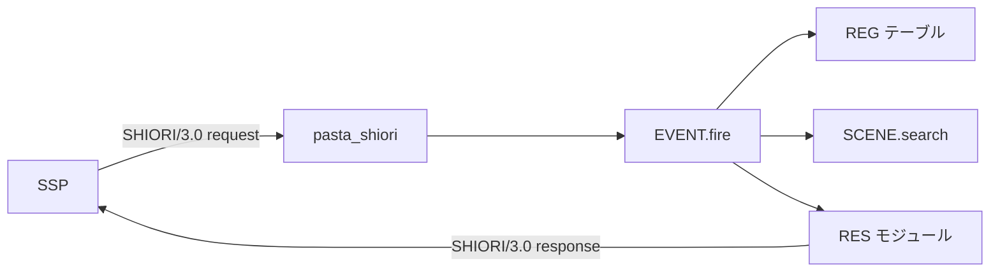

# Pasta Lua API リファレンス

pasta_lua クレートが Rust 側から Lua VM に公開しているモジュール・関数群のリファレンスドキュメントです。

## 目次

1. [モジュールカタログ](#1-モジュールカタログ)
2. [@pasta_search モジュール](#2-pasta_search-モジュール)
3. [@pasta_persistence モジュール](#3-pasta_persistence-モジュール)
4. [@enc モジュール](#4-enc-モジュール)
5. [@pasta_config モジュール](#5-pasta_config-モジュール)
6. [pasta.finalize_scene 関数](#6-pastafinalize_scene-関数)
7. [mlua-stdlib 統合モジュール](#7-mlua-stdlib-統合モジュール)
8. [SHIORI EVENT ハンドラ](#8-shiori-event-ハンドラ)

---

## 1. モジュールカタログ

### pasta_lua 固有モジュール

| モジュール名 | カテゴリ | バージョン | 説明 |
|-------------|----------|------------|------|
| `@pasta_search` | 検索系 | — | シーン・単語の検索機能を提供 |
| `@pasta_persistence` | 永続化系 | 0.1.0 | セーブデータの保存・読み込み |
| `@enc` | エンコーディング系 | 0.1.0 | UTF-8 ⇔ ANSI 文字コード変換 |
| `@pasta_config` | 設定系 | — | pasta.toml のカスタムフィールドへのアクセス |

### SHIORI 系モジュール

| モジュール名 | カテゴリ | 説明 |
|-------------|----------|------|
| `pasta.shiori.event` | イベント系 | SHIORI/3.0 イベントディスパッチ |
| `pasta.shiori.event.register` | イベント系 | イベントハンドラ登録テーブル (REG) |
| `pasta.shiori.res` | レスポンス系 | SHIORI/3.0 レスポンス生成 (RES) |

### mlua-stdlib 統合モジュール

| モジュール名 | カテゴリ | デフォルト | 説明 |
|-------------|----------|------------|------|
| `@assertions` | テスト系 | ✅ 有効 | アサーション関数群 |
| `@testing` | テスト系 | ✅ 有効 | テストフレームワーク |
| `@regex` | ユーティリティ系 | ✅ 有効 | 正規表現サポート |
| `@json` | ユーティリティ系 | ✅ 有効 | JSON エンコード/デコード |
| `@yaml` | ユーティリティ系 | ✅ 有効 | YAML エンコード/デコード |
| `@env` | システム系 | ❌ 無効 | 環境変数・ファイルパスアクセス（セキュリティ上デフォルト無効） |

---

## 2. @pasta_search モジュール

シーンと単語の検索機能を提供するモジュールです。

```lua
local SEARCH = require "@pasta_search"
```

### 2.1 search_scene(name, global_scene_name?)

シーンを検索します。フォールバック戦略（ローカル → グローバル）を使用します。

#### シグネチャ

```lua
SEARCH:search_scene(name, global_scene_name?) -> global_name, local_name | nil
```

#### パラメータ

| パラメータ | 型 | 必須 | 説明 |
|-----------|-----|------|------|
| `name` | string | ✅ | 検索するシーン名（前方一致） |
| `global_scene_name` | string | ❌ | 親シーン名（指定時はローカル検索を優先） |

#### 戻り値

- **成功時**: `global_name, local_name` の2値を返す
  - `global_name`: グローバルシーン名（例: `"メイン_1"`）
  - `local_name`: ローカルシーン名（例: `"__選択肢_1__"` または `"__start__"`）
- **失敗時**: `nil`（シーンが見つからない場合）

#### フォールバック検索戦略

`global_scene_name` が指定された場合:
1. まずローカルシーン（指定されたグローバルシーン内）を検索
2. 見つからなければグローバルシーンにフォールバック

`global_scene_name` が省略された場合:
- グローバルシーンのみを検索

#### 例

```lua
local SEARCH = require "@pasta_search"

-- グローバル検索のみ
local global, local_name = SEARCH:search_scene("メイン")
if global then
    print("Found:", global, local_name)  -- "メイン_1", "__start__"
end

-- ローカル優先検索（フォールバック付き）
local g, l = SEARCH:search_scene("選択肢", "メイン_1")
if g then
    print("Found local scene:", g, l)  -- "メイン_1", "__選択肢_1__"
end

-- 見つからない場合
local result = SEARCH:search_scene("存在しないシーン")
if not result then
    print("Scene not found")
end
```

### 2.2 search_word(name, global_scene_name?)

単語を検索します。フォールバック戦略（ローカル → グローバル）を使用します。

#### シグネチャ

```lua
SEARCH:search_word(name, global_scene_name?) -> string | nil
```

#### パラメータ

| パラメータ | 型 | 必須 | 説明 |
|-----------|-----|------|------|
| `name` | string | ✅ | 検索する単語キー |
| `global_scene_name` | string | ❌ | 親シーン名（指定時はローカル単語を優先） |

#### 戻り値

- **成功時**: 単語の値（文字列）
- **失敗時**: `nil`（単語が見つからない場合）

#### 例

```lua
local SEARCH = require "@pasta_search"

-- グローバル単語を検索
local word = SEARCH:search_word("挨拶")
if word then
    print(word)  -- "こんにちは"
end

-- ローカル単語を優先検索
local local_word = SEARCH:search_word("返事", "メイン_1")
if local_word then
    print(local_word)  -- シーン固有の返事
end
```

### 2.3 set_scene_selector(...) / set_word_selector(...)

テスト用にランダム選択を決定論的に制御します。

#### シグネチャ

```lua
SEARCH:set_scene_selector(n1, n2, ...)  -- シーケンス設定
SEARCH:set_scene_selector()             -- デフォルトに戻す

SEARCH:set_word_selector(n1, n2, ...)   -- シーケンス設定
SEARCH:set_word_selector()              -- デフォルトに戻す
```

#### パラメータ

| パラメータ | 型 | 説明 |
|-----------|-----|------|
| `n1, n2, ...` | integer | 選択インデックスのシーケンス（0始まり） |

引数なしで呼び出すとデフォルトのランダム選択に戻ります。

#### 用途

複数の候補がある場合（重複シーン、複数値の単語など）、通常はランダムに選択されます。テストでは決定論的な動作が必要なため、選択順序を事前に指定できます。

#### 例

```lua
local SEARCH = require "@pasta_search"

-- テスト用: 常に最初の候補を選択
SEARCH:set_scene_selector(0, 0, 0)

-- テスト用: 1番目、2番目、1番目の順に選択
SEARCH:set_word_selector(0, 1, 0)

-- テスト後: デフォルトのランダム選択に戻す
SEARCH:set_scene_selector()
SEARCH:set_word_selector()
```

---

## 3. @pasta_persistence モジュール

セーブデータの永続化機能を提供するモジュールです。

```lua
local persistence = require "@pasta_persistence"
```

### モジュールメタデータ

| フィールド | 値 |
|-----------|-----|
| `_VERSION` | `"0.1.0"` |
| `_DESCRIPTION` | `"Persistent data storage (JSON/gzip)"` |

### 3.1 load()

永続化ファイルからデータを読み込みます。

#### シグネチャ

```lua
persistence.load() -> table
```

#### 戻り値

- **成功時**: 保存されていたデータ（Luaテーブル）
- **ファイル未存在時**: 空テーブル `{}`
- **読み込みエラー時**: 空テーブル `{}`（エラーログ出力）

#### 特記事項

- ファイルが存在しない場合（初回起動時など）は空テーブルを返します
- ファイルが破損している場合も空テーブルを返します（データ損失を防ぐためエラーは握りつぶされます）
- gzip圧縮されたファイル（`.dat`）も自動的に検出・展開されます

#### 例

```lua
local persistence = require "@pasta_persistence"

-- データ読み込み（初回起動時は空テーブル）
local data = persistence.load()

-- デフォルト値の設定
data.play_count = data.play_count or 0
data.player_name = data.player_name or "Guest"

print("プレイ回数:", data.play_count)
```

### 3.2 save(data)

データを永続化ファイルに保存します。

#### シグネチャ

```lua
persistence.save(data) -> true, nil | nil, error_message
```

#### パラメータ

| パラメータ | 型 | 必須 | 説明 |
|-----------|-----|------|------|
| `data` | table | ✅ | 保存するデータ（Luaテーブル） |

#### 戻り値

- **成功時**: `true, nil`
- **失敗時**: `nil, error_message`

#### エラー条件

- Lua値のJSON変換失敗（循環参照、関数値など）
- ファイル書き込み失敗（権限不足、ディスク容量不足など）

#### 例

```lua
local persistence = require "@pasta_persistence"

local data = persistence.load()
data.play_count = (data.play_count or 0) + 1
data.last_played = os.date()

local ok, err = persistence.save(data)
if not ok then
    print("保存失敗:", err)
end
```

### 3.3 設定オプション（pasta.toml）

`pasta.toml` の `[persistence]` セクションで動作をカスタマイズできます。

```toml
[persistence]
# gzip圧縮を有効化（難読化）
obfuscate = true

# 保存先パス（デフォルト: "profile/pasta/save/save.json"）
# obfuscate=true の場合、拡張子は自動的に .dat に変更されます
file_path = "profile/pasta/save/save.json"

# デバッグログ出力
debug_mode = false
```

| オプション | 型 | デフォルト | 説明 |
|-----------|-----|------------|------|
| `obfuscate` | bool | `false` | gzip圧縮を有効化（ファイル拡張子が `.dat` に変更） |
| `file_path` | string | `"profile/pasta/save/save.json"` | 保存先パス |
| `debug_mode` | bool | `false` | デバッグログ出力を有効化 |

---

## 4. @enc モジュール

UTF-8 と ANSI（システムロケール）間の文字コード変換を提供するモジュールです。  
主にWindows環境でのファイルパス処理に使用します。

```lua
local enc = require "@enc"
```

### モジュールメタデータ

| フィールド | 値 |
|-----------|-----|
| `_VERSION` | `"0.1.0"` |
| `_DESCRIPTION` | `"Encoding conversion (UTF-8 <-> ANSI)"` |

### 4.1 to_ansi(utf8_str)

UTF-8 文字列を ANSI エンコーディングに変換します。

#### シグネチャ

```lua
enc.to_ansi(utf8_str) -> ansi_string, nil | nil, error_message
```

#### パラメータ

| パラメータ | 型 | 必須 | 説明 |
|-----------|-----|------|------|
| `utf8_str` | string | ✅ | 変換元のUTF-8文字列 |

#### 戻り値

- **成功時**: `ansi_string, nil`
- **失敗時**: `nil, error_message`

#### エラーケース

- 入力が有効なUTF-8でない場合
- ANSI変換に失敗した場合（表現できない文字を含む）

#### 例（Windows ファイルパス処理）

```lua
local enc = require "@enc"

-- UTF-8 パスを ANSI に変換（Windows のファイル操作用）
local utf8_path = "C:/ユーザー/ドキュメント/設定.txt"
local ansi_path, err = enc.to_ansi(utf8_path)

if ansi_path then
    -- ANSI パスでファイル操作
    local file = io.open(ansi_path, "r")
    if file then
        local content = file:read("*a")
        file:close()
    end
else
    print("変換エラー:", err)
end
```

### 4.2 to_utf8(ansi_str)

ANSI エンコーディングのバイト列を UTF-8 文字列に変換します。

#### シグネチャ

```lua
enc.to_utf8(ansi_str) -> utf8_string, nil | nil, error_message
```

#### パラメータ

| パラメータ | 型 | 必須 | 説明 |
|-----------|-----|------|------|
| `ansi_str` | string | ✅ | 変換元のANSIバイト列 |

#### 戻り値

- **成功時**: `utf8_string, nil`
- **失敗時**: `nil, error_message`

#### 例

```lua
local enc = require "@enc"

-- ANSI で取得したパスを UTF-8 に変換（表示・ログ用）
local ansi_path = some_windows_api_result()
local utf8_path, err = enc.to_utf8(ansi_path)

if utf8_path then
    print("ファイルパス:", utf8_path)
else
    print("変換エラー:", err)
end
```

### 戻り値パターンについて

`@enc` モジュールの関数は `(result, error)` タプルパターンを採用しています：

```lua
local result, err = enc.to_ansi(input)
if result then
    -- 成功: result を使用
else
    -- 失敗: err にエラーメッセージ
end
```

このパターンにより、エラーハンドリングを明示的に行えます。

---

## 5. @pasta_config モジュール

`pasta.toml` のカスタムフィールドに読み取り専用でアクセスするモジュールです。

```lua
local config = require "@pasta_config"
```

### 特徴

- **読み取り専用**: 値の変更はできません
- **TOML構造の保持**: ネストしたテーブル構造がそのまま維持されます
- **動的アクセス**: 設定ファイルの任意のカスタムセクションにアクセス可能

### 公開されるフィールド

`pasta.toml` 内の `[loader]` セクション**以外**のすべてのセクション・フィールドが公開されます。

#### pasta.toml 例

```toml
[loader]
# loader セクションは @pasta_config には含まれない
pasta_patterns = ["dic/*/*.pasta"]

[character]
name = "まゆら"
age = 17

[character.appearance]
hair_color = "黒"
eye_color = "茶"

[system]
debug = true
version = "1.0.0"
```

### アクセス例

```lua
local config = require "@pasta_config"

-- トップレベルアクセス
print(config.character.name)  -- "まゆら"
print(config.character.age)   -- 17

-- ネストしたアクセス
print(config.character.appearance.hair_color)  -- "黒"

-- 存在確認
if config.system and config.system.debug then
    print("デバッグモード有効")
end

-- 安全なアクセス（nilガード）
local version = config.system and config.system.version or "unknown"
```

### 注意事項

- `[loader]` セクションは除外されます（内部設定のため）
- 設定ファイルが存在しない場合は空テーブルになります
- 型はTOMLの型がそのまま維持されます（数値、文字列、真偽値、配列、テーブル）

---

## 6. pasta.finalize_scene 関数

Lua 側のシーン・単語レジストリから `@pasta_search` モジュールを構築する内部関数です。

```lua
require("pasta").finalize_scene()
```

### 目的

この関数は、トランスパイル済みの Lua コードが読み込まれた後に呼び出され、以下の処理を行います：

1. `pasta.scene` レジストリから全シーン情報を収集
2. `pasta.word` レジストリから全単語定義を収集
3. `SceneRegistry` と `WordDefRegistry` を構築
4. `SearchContext` を作成し `@pasta_search` モジュールとして登録

### 呼び出しタイミング

通常、`scene_dic.lua` の末尾で自動的に呼び出されます：

```lua
-- scene_dic.lua (自動生成)
require("scene.main")
require("scene.sub")
-- ...
require("pasta").finalize_scene()  -- 最後に呼び出し
```

### 処理フロー

```
pasta.scene レジストリ
       ↓
  collect_scenes()
       ↓
   SceneRegistry
       ↓                    ↘
                         SearchContext
       ↑                    ↗
   WordDefRegistry
       ↑
  collect_words()
       ↑
pasta.word レジストリ
```

### シーン収集（pasta.scene）

`pasta.scene` モジュールの `get_all_scenes()` を呼び出し、登録されているすべてのシーン関数を収集します。

構造:
```lua
{
  ["グローバルシーン名"] = {
    __global_name__ = "グローバルシーン名",
    __start__ = function() ... end,
    __ローカルシーン名__ = function() ... end,
  },
  ...
}
```

### 単語収集（pasta.word）

`pasta.word` モジュールの `get_all_words()` を呼び出し、グローバル単語とローカル単語を収集します。

構造:
```lua
{
  global = {
    ["キー"] = {{"値1", "値2"}, {"値3"}},
  },
  ["local"] = {
    ["シーン名"] = {
      ["キー"] = {{"ローカル値"}},
    },
  },
}
```

### 上級開発者向け情報

カスタムローダーやテスト環境を構築する場合：

- この関数は `scene_dic.lua` 読み込み前に Rust 側で登録されます
- Lua 側のスタブ実装を Rust バインディングで上書きする形式です
- 呼び出し後、`@pasta_search` モジュールが使用可能になります

---

## 7. mlua-stdlib 統合モジュール

pasta_lua は [mlua-stdlib](https://github.com/khvzak/mlua-stdlib) を統合しており、追加のユーティリティモジュールが利用可能です。

### デフォルトで有効なモジュール

#### @assertions

アサーション関数を提供します。

```lua
local assert = require "@assertions"

assert.equal(1, 1)
assert.not_equal(1, 2)
assert.truthy(true)
assert.falsy(nil)
```

#### @testing

テストフレームワークを提供します。

```lua
local testing = require "@testing"

testing.describe("My Feature", function()
    testing.it("should work", function()
        -- テストコード
    end)
end)
```

#### @regex

正規表現サポートを提供します。

```lua
local regex = require "@regex"

local pattern = regex.new("\\d+")
local matches = pattern:find_all("abc123def456")
```

#### @json

JSON エンコード/デコードを提供します。

```lua
local json = require "@json"

local str = json.encode({name = "test", value = 42})
local obj = json.decode('{"name": "test"}')
```

#### @yaml

YAML エンコード/デコードを提供します。

```lua
local yaml = require "@yaml"

local str = yaml.encode({name = "test"})
local obj = yaml.decode("name: test")
```

### デフォルトで無効なモジュール

#### @env

環境変数とファイルシステムパスへのアクセスを提供します。

**⚠️ セキュリティ上の理由からデフォルトで無効になっています。**

有効化するには、Rust 側で `RuntimeConfig` を設定する必要があります：

```rust
let config = RuntimeConfig {
    enable_env: true,  // @env を有効化
    ..RuntimeConfig::new()
};
```

```lua
-- @env が有効な場合のみ使用可能
local env = require "@env"
local home = env.var("HOME")
```

### RuntimeConfig によるモジュール制御

Rust 側で `RuntimeConfig` を使用して、各モジュールの有効/無効を制御できます：

```rust
use pasta_lua::RuntimeConfig;

// デフォルト設定（@env 以外すべて有効）
let config = RuntimeConfig::new();

// すべて有効（@env 含む）
let config = RuntimeConfig::full();

// 最小設定（pasta モジュールのみ）
let config = RuntimeConfig::minimal();

// カスタム設定
let config = RuntimeConfig {
    enable_std_libs: true,
    enable_assertions: true,
    enable_testing: false,  // テストモジュール無効
    enable_env: false,
    enable_regex: true,
    enable_json: true,
    enable_yaml: false,     // YAML無効
};
```

### 外部リファレンス

詳細な API 仕様については、各ライブラリの公式ドキュメントを参照してください：

- [mlua-stdlib](https://github.com/khvzak/mlua-stdlib) - mlua 用標準ライブラリ
- [mlua](https://docs.rs/mlua) - Lua-Rust バインディング

---

## 8. SHIORI EVENT ハンドラ

SHIORI/3.0 プロトコルにおけるイベントハンドリング機構を提供するモジュール群です。

### 8.1 概要

SSP (ベースウェア) からの SHIORI/3.0 リクエストを受け取り、Lua 関数で処理するための機構を提供します。



### 8.2 REG テーブルへの登録

イベントハンドラは `pasta.shiori.event.register` (REG テーブル) に登録します。

```lua
local REG = require("pasta.shiori.event.register")
local RES = require("pasta.shiori.res")

-- イベントハンドラの登録
REG.OnBoot = function(req)
    return RES.ok("\\h\\s[0]起動しました。\\e")
end

REG.OnClose = function(req)
    return RES.ok("\\h\\s[0]終了します。\\e")
end
```

### 8.3 サポートイベント一覧

#### 8.3.1 OnFirstBoot — 初回起動

ゴーストが初めて起動されたとき、またはバニッシュから復帰したときに発火します。

| Reference | 型 | 説明 |
|-----------|-----|------|
| `req.reference[0]` | string | バニッシュ復帰フラグ ("0": 初回, "1": 復帰) |

```lua
REG.OnFirstBoot = function(req)
    local is_vanish_return = req.reference[0] == "1"
    if is_vanish_return then
        return RES.ok("\\h\\s[0]帰ってきたわ。\\e")
    end
    return RES.ok("\\h\\s[0]はじめまして。\\e")
end
```

#### 8.3.2 OnBoot — 通常起動

ゴーストが起動されるたびに発火します。

| Reference | 型 | 説明 |
|-----------|-----|------|
| `req.reference[0]` | string | シェル名 |
| `req.reference[6]` | string | シェルパス |
| `req.reference[7]` | string | ゴーストパス |

```lua
REG.OnBoot = function(req)
    local shell_name = req.reference[0]
    return RES.ok("\\h\\s[0]起動しました。シェル: " .. (shell_name or "不明") .. "\\e")
end
```

#### 8.3.3 OnClose — 終了

ゴーストが終了するときに発火します。

| Reference | 型 | 説明 |
|-----------|-----|------|
| `req.reference[0]` | string | 終了理由 ("user", "shutdown" 等) |

```lua
REG.OnClose = function(req)
    local reason = req.reference[0]
    if reason == "user" then
        return RES.ok("\\h\\s[0]またね。\\e")
    end
    return RES.ok("\\h\\s[0]終了します。\\e")
end
```

#### 8.3.4 OnGhostChanged — ゴースト切り替え

他のゴーストに切り替わるときに発火します。

| Reference | 型 | 説明 |
|-----------|-----|------|
| `req.reference[0]` | string | 切り替え先ゴースト名 |
| `req.reference[1]` | string | 切り替え元ゴースト名 |

```lua
REG.OnGhostChanged = function(req)
    local to_ghost = req.reference[0]
    return RES.ok("\\h\\s[0]" .. (to_ghost or "別のゴースト") .. "に交代するわ。\\e")
end
```

#### 8.3.5 OnSecondChange — 毎秒

毎秒発火します（高頻度）。

| Reference | 型 | 説明 |
|-----------|-----|------|
| `req.reference[0]` | string | 現在秒 (0-59) |
| `req.reference[1]` | string | 累積秒 |

```lua
REG.OnSecondChange = function(req)
    -- 通常は空応答（alpha02 で仮想イベント発行に利用予定）
    return RES.no_content()
end
```

#### 8.3.6 OnMinuteChange — 毎分

毎分発火します。

| Reference | 型 | 説明 |
|-----------|-----|------|
| `req.reference[0]` | string | 現在分 (0-59) |
| `req.reference[1]` | string | 現在時 (0-23) |

```lua
REG.OnMinuteChange = function(req)
    local minute = req.reference[0]
    local hour = req.reference[1]
    -- 正時のみ時報
    if minute == "0" then
        return RES.ok("\\h\\s[0]" .. hour .. "時よ。\\e")
    end
    return RES.no_content()
end
```

#### 8.3.7 OnMouseDoubleClick — ダブルクリック

キャラクターをダブルクリックしたときに発火します。

| Reference | 型 | 説明 |
|-----------|-----|------|
| `req.reference[0]` | string | スコープ ("0": sakura, "1": kero) |
| `req.reference[4]` | string | 当たり判定 ID |

```lua
REG.OnMouseDoubleClick = function(req)
    local scope = req.reference[0]
    local hit_area = req.reference[4]
    if scope == "0" then
        return RES.ok("\\h\\s[0]なあに？\\e")
    else
        return RES.ok("\\u\\s[0]呼んだ？\\e")
    end
end
```

### 8.4 RES レスポンス生成

`pasta.shiori.res` モジュールは SHIORI/3.0 レスポンス文字列を生成します。

```lua
local RES = require("pasta.shiori.res")
```

| 関数 | 説明 | 生成されるステータス |
|------|------|---------------------|
| `RES.ok(value)` | 成功レスポンス + Value | 200 OK |
| `RES.ok_with(headers)` | 成功レスポンス + 複数ヘッダ | 200 OK |
| `RES.no_content()` | 空レスポンス | 204 No Content |
| `RES.err(message)` | エラーレスポンス | 500 Internal Server Error |

#### 使用例

```lua
-- 基本的な応答
return RES.ok("\\h\\s[0]こんにちは\\e")

-- 空応答（イベントを処理したが表示なし）
return RES.no_content()

-- エラー応答
return RES.err("設定ファイルが見つかりません")
```

### 8.5 シーン関数フォールバック

REG テーブルにハンドラが登録されていない場合、`SCENE.search` でグローバルシーンを検索します。

```mermaid
graph TD
    A[EVENT.fire] --> B{REG[req.id] 存在?}
    B -->|Yes| C[ハンドラ実行]
    B -->|No| D[EVENT.no_entry]
    D --> E{SCENE.search}
    E -->|見つかった| F[シーン関数実行]
    E -->|見つからない| G[204 No Content]
    F --> H[204 No Content]
```

Pasta スクリプトで定義したシーンは、イベント名と同じグローバルシーン名で検索されます：

```
＊OnBoot
こんにちは。
```

上記のシーンは `OnBoot` イベントで REG ハンドラがない場合に自動的に呼び出されます（alpha01 では 204 固定応答、alpha03 でさくらスクリプト生成予定）。

### 8.6 エラーハンドリング

イベントハンドラ実行時の例外は `xpcall` でキャッチされ、`RES.err()` でエラーレスポンスが生成されます。

```lua
REG.OnBoot = function(req)
    -- エラーが発生した場合
    error("何かがおかしい")
    -- → SHIORI/3.0 500 Internal Server Error
end
```

シーン関数フォールバック時も同様に `pcall` でエラーがキャッチされます。

### 8.7 Reference パラメータへのアクセス

`req.reference` テーブルで SHIORI Reference ヘッダにアクセスできます。

```lua
-- 0始まりインデックス
local ref0 = req.reference[0]  -- Reference0 の値
local ref1 = req.reference[1]  -- Reference1 の値
-- ...
local ref7 = req.reference[7]  -- Reference7 の値

-- 存在しない Reference は nil
if req.reference[5] == nil then
    print("Reference5 は送信されていません")
end
```

### 8.8 virtual_dispatcher モジュール

`pasta.shiori.event.virtual_dispatcher` は OnSecondChange をトリガーとして OnTalk/OnHour 仮想イベントを発行するモジュールです。

```lua
local dispatcher = require("pasta.shiori.event.virtual_dispatcher")
```

#### 8.8.1 dispatch(req)

メインエントリポイント。OnSecondChange リクエストから OnHour/OnTalk イベントを判定・発行します。

```lua
---@param req table リクエストテーブル (req.date.unix 必須)
---@return string|nil "fired" (発行成功), nil (発行なし)
local result = dispatcher.dispatch(req)
```

- OnHour を優先判定し、発火しなければ OnTalk を判定
- `req.date` フィールドがない場合は `nil` を返却
- `req.status == "talking"` の場合はスキップ

#### 8.8.2 check_hour(req)

OnHour イベントの判定・発行のみを行います。

```lua
---@param req table リクエストテーブル
---@return string|nil "fired" or nil
local result = dispatcher.check_hour(req)
```

- 初回呼び出し時は次の正時を計算してスキップ
- 正時超過時に OnHour シーンを検索・実行

#### 8.8.3 check_talk(req)

OnTalk イベントの判定・発行のみを行います。

```lua
---@param req table リクエストテーブル
---@return string|nil "fired" or nil
local result = dispatcher.check_talk(req)
```

- `pasta.toml` の `[ghost]` セクションから設定を読み込み
  - `talk_interval_min`: 最小トーク間隔（秒、デフォルト180）
  - `talk_interval_max`: 最大トーク間隔（秒、デフォルト300）
  - `hour_margin`: 時報前スキップマージン（秒、デフォルト30）
- 時報前マージン内の場合はスキップ

#### 8.8.4 テスト用関数

```lua
-- 状態リセット（セッション開始時相当）
dispatcher._reset()

-- 内部状態取得
local state = dispatcher._get_internal_state()
-- { next_hour_unix, next_talk_time, cached_config }

-- シーン実行関数のモック差し替え
dispatcher._set_scene_executor(function(event_name)
    return "mocked_result"
end)
```

#### 8.8.5 セッション定義

- **セッション** = SHIORI load 〜 unload 間
- unload 時に Lua VM ごとドロップされるため、モジュールローカル変数は自動リセット

---

## 更新履歴

| 日付 | バージョン | 変更内容 |
|------|------------|----------|
| 2026-01-27 | 1.0.0 | 初版作成 |
| 2026-01-27 | 1.1.0 | SHIORI EVENT ハンドラセクション追加 |
