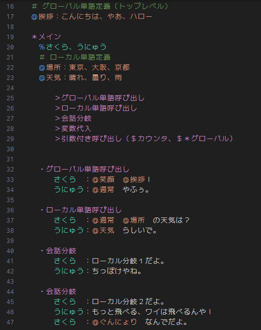

# Pasta DSL

Pasta DSL（`*.pasta` ファイル）のシンタックスハイライトと診断情報を提供する VSCode 拡張です。

## 機能

- **TextMate 文法ハイライト** — 全角/半角マーカー両対応の構文ハイライト
- **セマンティックトークン** — pasta_lsp (WASM) による14種のセマンティックトークン提供
- **診断情報** — パースエラーの Problems パネル表示
- **フォールバック** — WASM ロード失敗時は TextMate 文法のみで動作

## Pasta DSL とは

Pasta は「伺か」のようなデスクトップマスコットなどを実現するための対話スクリプト言語です。日本語フレンドリーな全角マーカーと宣言的フロー制御が特徴です。

詳しくは [GitHub リポジトリ](https://github.com/ekicyou/pasta) をご覧ください。

## 対応環境

- VSCode ^1.85.0

## セマンティックトークン一覧

| # | タイプ       | Pasta 構文要素                  |
|---|-------------|--------------------------------|
| 0 | comment     | コメント行 (`＃` / `#`)        |
| 1 | namespace   | グローバルシーン (`＊` / `*`)  |
| 2 | scene       | ローカルシーン (`・` / `-`)    |
| 3 | decorator   | 属性定義 (`＆` / `&`)         |
| 4 | word        | 単語定義 (`＠` / `@`)         |
| 5 | variable    | 変数参照 (`＄` / `$`)         |
| 6 | call        | Call文 (`＞` / `>`)           |
| 7 | actor       | アクター定義 (`％` / `%`)     |
| 8 | actorName   | アクション行のアクター名       |
| 9 | codeBlock   | Lua コードブロック             |
| 10| string      | Talk テキスト                  |
| 11| sakuraScript| さくらスクリプトタグ           |
| 12| escape      | エスケープシーケンス           |
| 13| operator    | コロン区切り (`：` / `:`)     |

## ライセンス

MIT
